## Project: Provision EC2 or AWS Transfer for SFTP CSV Upload (Spike)


### Project Overview:

Provision EC2 instance or AWS Transfer Family SFTP server for secure CSV file uploads using Terraform with modular design and GitHub Actions CI/CD.

---

### FILE STRUCTURE

```
terraform/
├── main.tf
├── variables.tf
├── outputs.tf
├── terraform.tfvars
├── backend.tf                 # (optional: for remote backend like S3)
├── data.tf                    # for aws_caller_identity
├── README.md                  # already present
├── .ssh/                      # stores generated private keys by Terraform
│   ├── idoko.pem
│   ├── ernest.pem
│   └── ...
├── .github/
│   └── workflows/
│       └── terraform.yml
├── scripts/
│   └── install-vsftpd.sh
├── modules/
│   ├── network/
│   │   ├── main.tf
│   │   ├── variables.tf
│   │   └── outputs.tf
│   ├── ec2_sftp/
│   │   ├── main.tf
│   │   ├── variables.tf
│   │   └── outputs.tf
│   ├── aws_transfer_sftp/
│   │   ├── main.tf
│   │   ├── variables.tf
│   │   └── outputs.tf
│   ├── ssh_key_pair/
│   │   ├── main.tf
│   │   ├── variables.tf
│   │   └── outputs.tf
│   ├── iam_user_policy_sftp_csv_upload/
│   │   ├── main.tf
│   │   ├── variables.tf
│   │   └── outputs.tf
│   └── aws_iam_user/          # IAM user creation for GitHub Actions
│       ├── main.tf
│       ├── variables.tf
│       └── outputs.tf

```

---

### Step 0: Prerequisites and Setup

**Purpose:**

- Prepare environment with AWS CLI, Terraform, AWS credentials, and SSH key pair for EC2 access.

**Steps Taken:**

- Configured AWS CLI locally with proper credentials.
- Installed Terraform on my machine.
- Stored AWS credentials (AWS_ACCESS_KEY_ID, AWS_SECRET_ACCESS_KEY) securely as GitHub Secrets.
- Created SSH key pair using AWS CLI to enable SSH access to EC2 instances.

**Command:**

```bash
aws ec2 create-key-pair --key-name ftp-key --query 'KeyMaterial' --output text --region us-east-1 > ftp-key.pem
chmod 400 ftp-key.pem
```

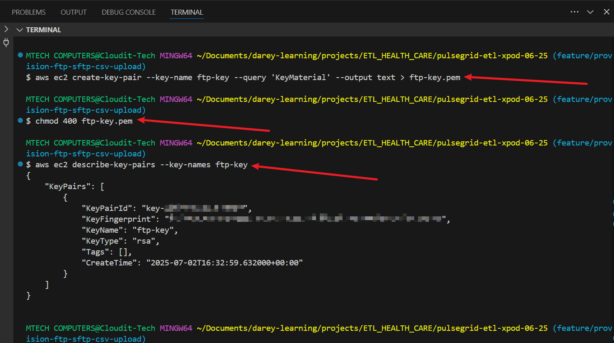

---

### Step 1: Create Bootstrap Script (install-vsftpd.sh)

**Purpose:**

- Install and configure `vsftpd` FTP server on EC2 instance automatically on launch.

**Steps Taken:**
- Wrote shell script to update apt packages, install `vsftpd`, configure for secure FTP (**disable anonymous, enable local users and write**), and **enable service**.

**Content:**

```bash
#!/bin/bash
apt-get update -y
apt-get install -y vsftpd

cp /etc/vsftpd.conf /etc/vsftpd.conf.bak
sed -i 's/anonymous_enable=YES/anonymous_enable=NO/' /etc/vsftpd.conf
sed -i 's/#local_enable=YES/local_enable=YES/' /etc/vsftpd.conf
sed -i 's/#write_enable=YES/write_enable=YES/' /etc/vsftpd.conf

systemctl restart vsftpd
systemctl enable vsftpd
```

---

### Step 2: Define Network Module (`modules/network`)

**Purpose:**

- Provision dedicated `VPC` and `subnet` for hosting `EC2` and **Transfer Family services**.

**Steps Taken:**

- Created `aws_vpc` resource with CIDR block `10.0.0.0/16`.
- Created a `subnet` in the first availability zone with CIDR block `10.0.1.0/24`.
- Output the `VPC` and `subnet IDs` for reuse.

### modules/network/main.tf

```bash
resource "aws_vpc" "main" {
  cidr_block           = "10.0.0.0/16"
  enable_dns_hostnames = true

  tags = {
    Name = "ftp-vpc"
  }
}

data "aws_availability_zones" "available" {}

resource "aws_subnet" "public" {
  vpc_id            = aws_vpc.main.id
  cidr_block        = "10.0.1.0/24"
  map_public_ip_on_launch = true
  availability_zone = data.aws_availability_zones.available.names[0]

  tags = {
    Name = "ftp-subnet"
  }
}
```

### modules/network/outputs.tf

```bash
output "vpc_id" {
  value = aws_vpc.main.id
  description = "ID of the main VPC"
}

output "subnet_id" {
  value = aws_subnet.public.id
  description = "ID of the public subnet"
}
```
---

### Step 3: Define EC2 SFTP Module (`modules/ec2_sftp`)

**Purpose:**

- Provision EC2 instance with `vsftpd` installed to simulate FTP server for CSV upload.

**Steps Taken:**

- Used Ubuntu 20.04 AMI data source for latest AMI.
- Created a security group allowing TCP port 21 inbound from allowed IPs.
- Provisioned EC2 instance with `user_data` to run **bootstrap script**.
- Tagged resources for easy identification.
- Output EC2 public IP for access.

### modules/ec2_sftp/main.tf

```bash
data "aws_ami" "ubuntu" {
  most_recent = true
  owners      = ["099720109477"]

  filter {
    name   = "name"
    values = ["ubuntu/images/hvm-ssd/ubuntu-focal-20.04-amd64-server-*"]
  }
}

resource "aws_security_group" "ftp_sg" {
  name        = "ftp-sg"
  description = "Allow FTP access"
  vpc_id      = var.vpc_id

  ingress {
    from_port   = 21
    to_port     = 21
    protocol    = "tcp"
    cidr_blocks = var.allowed_ips
  }

  egress {
    from_port   = 0
    to_port     = 0
    protocol    = "-1"
    cidr_blocks = ["0.0.0.0/0"]
  }
}

resource "aws_instance" "ftp_server" {
  ami                    = data.aws_ami.ubuntu.id
  instance_type          = var.instance_type
  key_name               = var.key_name
  subnet_id              = var.subnet_id
   associate_public_ip_address = true
  vpc_security_group_ids = [aws_security_group.ftp_sg.id]
  user_data              = file("${path.module}/../../scripts/install-vsftpd.sh")

  tags = {
    Name = "ftp-server"
  }
}
```

### modules/ec2_sftp/variables.tf

```hcl
# IAM user and GitHub integration
variable "iam_user_name" {
  description = "Name of the IAM user to create and manage"
  type        = string
}

variable "github_repo" {
  description = "GitHub repository name where secrets will be stored"
  type        = string
}

# S3 buckets for clean and raw data
variable "clean_data_name" {
  description = "S3 bucket name for clean data"
  type        = string
}

variable "github_user_name" {
  description = "GitHub username for IAM user policy integration"
  type        = string
}


variable "raw_data_name" {
  description = "S3 bucket name for raw data"
  type        = string
}

variable "sse_algorithm" {
  description = "Server-side encryption algorithm to use (e.g., aws:kms)"
  type        = string
}

variable "env" {
  description = "Environment (e.g., dev, staging, prod)"
  type        = string
}

# EC2 and networking
variable "instance_type" {
  description = "EC2 instance type for the SFTP server"
  type        = string
}

variable "key_name" {
  description = "SSH key pair name to attach to EC2 instance"
  type        = string
}

variable "allowed_ips" {
  description = "List of allowed CIDR IPs for accessing EC2 instance"
  type        = list(string)
}

# AWS Transfer Family (SFTP)
variable "iam_role_name" {
  description = "IAM role name used by AWS Transfer Family for SFTP access"
  type        = string
}

variable "s3_transfer_bucket" {
  description = "S3 bucket used by AWS Transfer Family to store files"
  type        = string
}

# Bucket names to reference in policy
variable "clean_data_bucket" {
  description = "S3 bucket name for clean data used in IAM policy"
  type        = string
}

variable "raw_data_bucket" {
  description = "S3 bucket name for raw data used in IAM policy"
  type        = string
}
```

### modules/ec2_sftp/outputs.tf

```bash
output "public_ip" {
  value       = aws_instance.ftp_server.public_ip
  description = "Public IP address of the EC2 SFTP instance"
}
```

---

### Step 4: Define AWS Transfer Family Module (`modules/aws_transfer_sftp`)

**Purpose:**

- Create AWS **Transfer Family SFTP server** for modern, managed `SFTP` file upload to `S3`.

**Steps Taken:**

- Created IAM role with assume role policy for `transfer.amazonaws.com` service.
- Attached inline policy granting full S3 access to specified bucket.
- Created Transfer Family SFTP server using service managed identity provider.
- Output the public endpoint of the server.

### modules/aws_transfer_sftp/main.tf

```bash
resource "aws_iam_role" "transfer_role" {
  name = var.iam_role_name

  assume_role_policy = jsonencode({
    Version = "2012-10-17",
    Statement = [{
      Effect    = "Allow",
      Principal = { Service = "transfer.amazonaws.com" },
      Action    = "sts:AssumeRole"
    }]
  })
}

resource "aws_iam_role_policy" "s3_access" {
  name = "S3TransferAccess"
  role = aws_iam_role.transfer_role.id

  policy = jsonencode({
    Version = "2012-10-17",
    Statement = [{
      Effect   = "Allow",
      Action   = ["s3:*"],
      Resource = [
        "arn:aws:s3:::${var.s3_bucket}",
        "arn:aws:s3:::${var.s3_bucket}/*"
      ]
    }]
  })
}

resource "aws_transfer_server" "sftp_server" {
  identity_provider_type = "SERVICE_MANAGED"
  endpoint_type          = "PUBLIC"
  logging_role           = aws_iam_role.transfer_role.arn

  tags = {
    Name = "TransferFamilySFTP"
  }
}
```

### modules/aws_transfer_sftp/variables.tf

```bash
variable "iam_role_name" {
  description = "Name of the IAM role used by Transfer Family"
  type        = string
}

variable "s3_bucket" {
  description = "S3 bucket name for file storage"
  type        = string
}
```

### modules/aws_transfer_sftp/outputs.tf

```hcl
output "endpoint" {
  value       = aws_transfer_server.sftp_server.endpoint
  description = "Public endpoint of the AWS Transfer Family SFTP server"
}
```

---

### Step 5: Integrate IAM User Policy Module

**Purpose:**

- Attach required policies to existing GitHub user `github-actions-user` for `S3` access.

**Steps Taken:**

- Pulled external terraform module "`iam_user_policy`" from **GitHub feature branch**.
- Passed GitHub username and S3 bucket names as variables.
- Let module handle creation and attachment of policies.

### Root `main.tf` snippet to call module

```hcl
# Call IAM module and push credentials to GitHub Secrets.
module "github_iam_user" {
  source        = "./modules/aws_iam_user"
  iam_user_name = var.iam_user_name
  }

# Store AWS Access Key ID in GitHub repository secrets
resource "github_actions_secret" "aws_access_key_id" {
  repository      = var.github_repo
  secret_name     = "AWS_ACCESS_KEY_ID"
  plaintext_value = module.github_iam_user.access_key_id
}

# Store AWS Secret Access Key in GitHub repository secrets
resource "github_actions_secret" "aws_secret_access_key" {
  repository      = var.github_repo
  secret_name     = "AWS_SECRET_ACCESS_KEY"
  plaintext_value = module.github_iam_user.secret_access_key
}

####################################################################
# Project: Provision EC2 or AWS Transfer for SFTP CSV Upload (Spike)
####################################################################


module "network" {
  source = "./modules/network"
}

module "ec2_sftp" {
  source        = "./modules/ec2_sftp"
  instance_type = var.instance_type
  key_name      = var.key_name
  vpc_id        = module.network.vpc_id
  subnet_id     = module.network.subnet_id
  allowed_ips   = var.allowed_ips
}

module "aws_transfer_sftp" {
  source       = "./modules/aws_transfer_sftp"
  iam_role_name = var.iam_role_name
  s3_bucket    = var.s3_transfer_bucket
}

module "iam_user_policy_sftp_csv_upload" {
  source         = "./modules/iam_user_policy_sftp_csv_upload"
  policy_name    = "S3AccessPolicyForCSVUpload"
  iam_user_name  = var.iam_user_name
  description    = "Policy to allow S3 access for CSV upload"

  policy_statements = [
    {
      Sid    = "AllowS3FullAccess"
      Effect = "Allow"
      Action = "s3:*"
      Resource = [
        "arn:aws:s3:::${var.clean_data_bucket}",
        "arn:aws:s3:::${var.clean_data_bucket}/*",
        "arn:aws:s3:::${var.raw_data_bucket}",
        "arn:aws:s3:::${var.raw_data_bucket}/*"
      ]
    }
  ]
}
```

---

### Step 6: Create Root Terraform Configuration

**Purpose:**

- Tie all modules together with proper input variables.

**Steps Taken:**

- Called `network`, `ec2_sftp`, `aws_transfer_sftp`, and `iam_user_policy` modules.
- Passed variables via `terraform.tfvars`.
- Defined outputs to display `EC2 IP` and `Transfer Family endpoint`.

### Root `main.tf`

```hcl
module "network" {
  source = "./modules/network"
}

module "ec2_sftp" {
  source        = "./modules/ec2_sftp"
  instance_type = var.instance_type
  key_name      = var.key_name
  vpc_id        = module.network.vpc_id
  subnet_id     = module.network.subnet_id
  allowed_ips   = var.allowed_ips
}

module "aws_transfer_sftp" {
  source       = "./modules/aws_transfer_sftp"
  iam_role_name = var.iam_role_name
  s3_bucket    = var.s3_transfer_bucket
}

module "iam_user_policy" {
  source          = "git::https://github.com/xterns/pulsegrid-etl-xpod-06-25.git//terraform/modules/iam_user_policy?ref=feature/understand-python-role-data-processing"
  github_user     = var.github_user_name
  s3_clean_bucket = var.s3_bucket
  s3_raw_bucket   = var.raw_bucket
}
```

### Root `variables.tf`

```hcl
# IAM user and GitHub integration
variable "iam_user_name" {
  description = "Name of the IAM user to create and manage"
  type        = string
}

# S3 buckets for clean and raw data
variable "clean_data_name" {
  description = "S3 bucket name for clean data"
  type        = string
}

variable "raw_data_name" {
  description = "S3 bucket name for raw data"
  type        = string
}

variable "sse_algorithm" {
  description = "Server-side encryption algorithm to use (e.g., aws:kms)"
  type        = string
}

variable "env" {
  description = "Environment (e.g., dev, staging, prod)"
  type        = string
}

# EC2 and networking
variable "instance_type" {
  description = "EC2 instance type for the SFTP server"
  type        = string
}

variable "key_name" {
  description = "SSH key pair name to attach to EC2 instance"
  type        = string
}

variable "allowed_ips" {
  description = "List of allowed CIDR IPs for accessing EC2 instance"
  type        = list(string)
}

# AWS Transfer Family (SFTP)
variable "iam_role_name" {
  description = "IAM role name used by AWS Transfer Family for SFTP access"
  type        = string
}

variable "s3_transfer_bucket" {
  description = "S3 bucket used by AWS Transfer Family to store files"
  type        = string
}

# Bucket names to reference in policy
variable "clean_data_bucket" {
  description = "S3 bucket name for clean data used in IAM policy"
  type        = string
}

variable "raw_data_bucket" {
  description = "S3 bucket name for raw data used in IAM policy"
  type        = string
}

variable "github_repo" {
  description = "GitHub repository name"
  type        = string
  default     = "pulsegrid-etl-xpod-06-25"
}

variable "github_owner" {
  description = "GitHub username or organization"
  type        = string
  default     = "xterns"
}

variable "github_token" {
  description = "GitHub personal access token"
  type        = string
  sensitive   = true
}
```

### Root `outputs.tf`

```hcl
output "ec2_public_ip" {
  value       = module.ec2_sftp.public_ip
  description = "Public IP of the EC2 FTP server"
}

output "transfer_endpoint" {
  value       = module.aws_transfer_sftp.endpoint
  description = "AWS Transfer Family SFTP endpoint"
}
```

---

### Step 7: Define Variables and tfvars

**Purpose:**

- Define inputs for modular and root terraform configurations.

**Steps Taken:**

- Declared variables such as `github_user_name`, `s3_bucket`, `raw_bucket`, `key_name`, `instance_type`, `allowed_ips`, `iam_role_name`, and `s3_transfer_bucket`.
- Provided environment-specific values in `terraform.tfvars`.

### Root `terraform.tfvars`

```hcl
secret
```

---

### Step 8: Setup GitHub Actions Workflow

**Purpose:**

- Automate `Terraform init`, `plan`, `validate`, and `apply` on `push/pull` requests.

**Steps Taken:**

- Configured workflow to run on push to main and feature branches.
- Used Hashicorp's official Terraform setup action.
- Passed AWS credentials from GitHub Secrets.
- Added conditional to auto-apply only on main branch pushes.

### .github/workflows/ftp-sftp-upload.yml

```yaml
name: ftp-sftp-upload CI/CD

on:
  push:
    branches:
      - main
      - 'feature/**'

jobs:
  terraform:
    runs-on: ubuntu-latest
    env:
      AWS_ACCESS_KEY_ID: ${{ secrets.AWS_ACCESS_KEY_ID }}
      AWS_SECRET_ACCESS_KEY: ${{ secrets.AWS_SECRET_ACCESS_KEY }}
      TF_VAR_github_token: ${{ secrets.TF_VAR_GITHUB_TOKEN }}
      TF_WORKING_DIR: terraform/

    steps:
      - name: Checkout repository
        uses: actions/checkout@v3

      - name: Setup Terraform
        uses: hashicorp/setup-terraform@v2
        with:
          terraform_version: 1.5.6

      - name: Terraform Init
        run: terraform init
        working-directory: ${{ env.TF_WORKING_DIR }}

      - name: Terraform Format Check
        run: terraform fmt -check
        working-directory: ${{ env.TF_WORKING_DIR }}

      - name: Terraform Validate
        run: terraform validate
        working-directory: ${{ env.TF_WORKING_DIR }}

      - name: Terraform Plan
        run: terraform plan
        working-directory: ${{ env.TF_WORKING_DIR }}

      - name: Terraform Apply
        if: github.ref == 'refs/heads/main'
        run: terraform apply -auto-approve
        working-directory: ${{ env.TF_WORKING_DIR }}
```
---

### Step 9: Usage and Deployment

**Purpose:**

- Run `terraform init` and `terraform apply` locally or push to GitHub to trigger workflow.
- Retrieve EC2 public IP and Transfer Family endpoint from outputs.
- Connect to EC2 via SSH with key for FTP testing.
- Use SFTP client to connect to AWS Transfer Family endpoint.

---

### terraform init

### Error

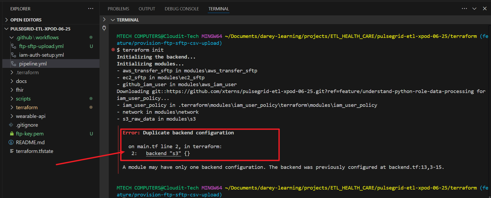

**What this means:**

Terraform backend configuration must be declared only once, and it must be in the root module (not inside child modules). You cannot have multiple backend configurations in your root or inside modules.

**How to fix:**
- Check your root directory for backend configuration

- You should have only one terraform { backend "s3" { ... } } block — typically this is in a file like backend.tf or directly inside your main.tf.

- Remove any duplicate backend blocks

    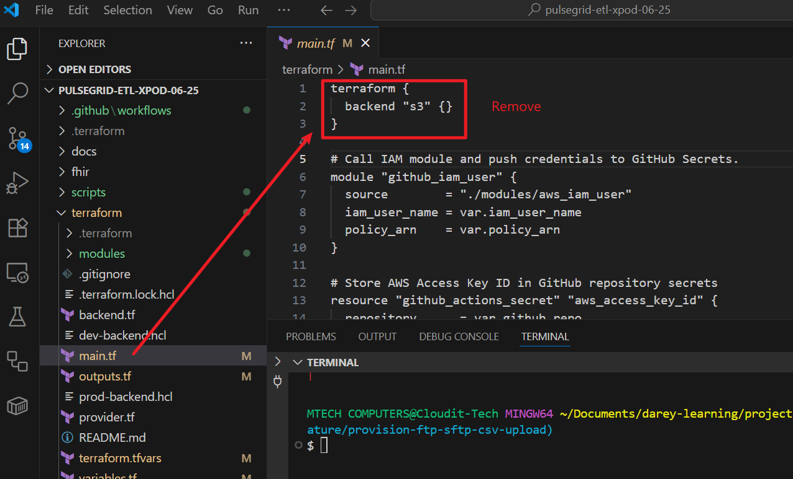

- If you have a backend block in main.tf and also one in backend.tf, move it to only one file.

    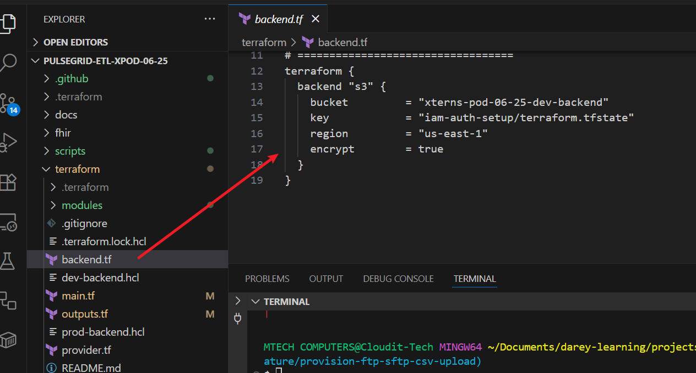

- Do NOT put a backend block inside any module (like inside `modules/aws_transfer_sftp/main.tf` or similar).

### Run:

### `terraform init -reconfigure`

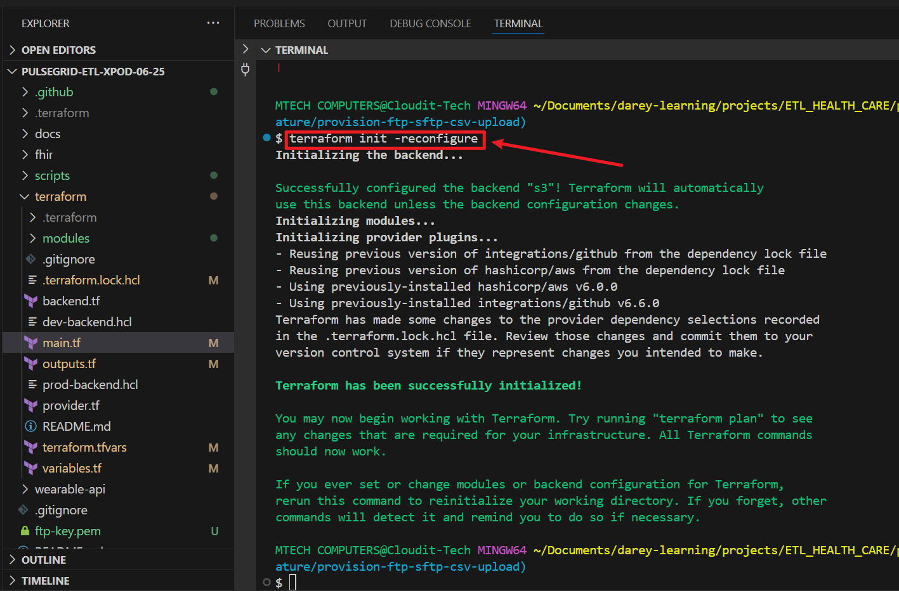

---

### terraform plan

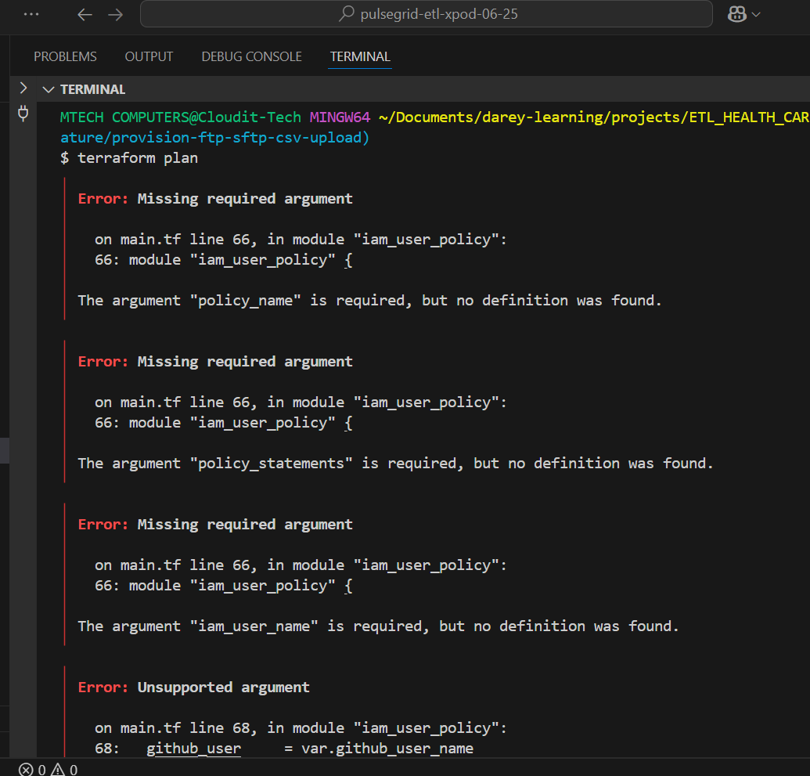

### Challenge Faced

While integrating the **IAM user policy module** from an external GitHub branch (`feature/understand-python-role-data-processing`), the following issues occurred:

- Terraform errors about missing required arguments (`policy_name`, `policy_statements`, `iam_user_name`).

- Unexpected/unsupported arguments like `github_user`, `s3_clean_bucket`, `s3_raw_bucket` which were not defined in the external module.

- Dependency on an unmerged branch created complexity and instability.

- Difficulty maintaining and debugging the external module integration in this project context.

### Resolution

To resolve these challenges, I **replaced the external IAM user policy module** with a **local module** defined inside my project under `/modules/iam_user_policy_sftp_csv_upload`. This local module contains only the needed variables and resources:

- `policy_name`

- `description`

- `policy_statements`

- `iam_user_name`

This makes the project:

- Fully **self-contained** and easy to maintain.

- Simplifies Terraform configurations by removing unsupported parameters.

- Avoids dependency on unmerged external branches.

---

---

### Step 10: modules/iam_user_policy_sftp_csv_upload/main.tf
*Purpose:* Create IAM Policy for Transfer Family Tagging and Attach to User
*Steps Taken:* Created policy allowing actions like transfer:TagResource, and attached it to the IAM user

```
resource "aws_iam_policy" "custom_user_policy" {
  name        = var.policy_name
  description = var.description

  policy = jsonencode({
    Version   = "2012-10-17",
    Statement = var.policy_statements
  })
}

resource "aws_iam_user_policy_attachment" "attach_policy" {
  user       = var.iam_user_name
  policy_arn = aws_iam_policy.custom_user_policy.arn
}
```

---

### Step 11: Root main.tf (IAM Tagging Policy)
*Purpose:* Attach a separate IAM policy to allow transfer:* operations
*Steps Taken:* Added a new root-level module instantiation to bind the new tagging policy to the IAM user

```
module "iam_user_policy_transfer_tag" {
  source         = "./modules/iam_user_policy_sftp_csv_upload"
  policy_name    = "TransferTagPolicy"
  iam_user_name  = var.iam_user_name
  description    = "Allow tagging for AWS Transfer Family server"

  policy_statements = [
    {
      Sid      = "AllowTransferTagging"
      Effect   = "Allow"
      Action   = [
        "transfer:TagResource",
        "transfer:CreateServer",
        "transfer:DescribeServer",
        "transfer:DeleteServer"
      ]
      Resource = "*"
    }
  ]
}
```

## (Updated)

### File Structure

```css
terraform/
├── main.tf
├── variables.tf
├── outputs.tf
├── terraform.tfvars
├── backend.tf                 # (optional: for remote backend like S3)
├── data.tf                    # for aws_caller_identity
├── README.md                  # already present
├── .ssh/                      # stores generated private keys by Terraform
│   ├── idoko.pem
│   ├── ernest.pem
│   └── ...
├── .github/
│   └── workflows/
│       └── terraform.yml
├── scripts/
│   └── install-vsftpd.sh
├── modules/
│   ├── network/
│   │   ├── main.tf
│   │   ├── variables.tf
│   │   └── outputs.tf
│   ├── ec2_sftp/
│   │   ├── main.tf
│   │   ├── variables.tf
│   │   └── outputs.tf
│   ├── aws_transfer_sftp/
│   │   ├── main.tf
│   │   ├── variables.tf
│   │   └── outputs.tf
│   ├── ssh_key_pair/
│   │   ├── main.tf
│   │   ├── variables.tf
│   │   └── outputs.tf
│   ├── iam_user_policy_sftp_csv_upload/
│   │   ├── main.tf
│   │   ├── variables.tf
│   │   └── outputs.tf
│   └── aws_iam_user/          # IAM user creation for GitHub Actions
│       ├── main.tf
│       ├── variables.tf
│       └── outputs.tf
```

### Step 1: `modules/iam_user_policy_sftp_csv_upload/main.tf`

**Purpose:** Define IAM policy resource and attach it to existing IAM user for required permissions.

**Steps Taken:** Created local module to avoid dependency on external modules and ensure uniqueness.

```hcl
resource "aws_iam_policy" "custom_user_policy" {
  name        = var.policy_name
  description = var.description

  policy = jsonencode({
    Version   = "2012-10-17",
    Statement = var.policy_statements
  })
}

resource "aws_iam_user_policy_attachment" "attach_policy" {
  user       = var.iam_user_name
  policy_arn = aws_iam_policy.custom_user_policy.arn
}
```

### Step 2: `modules/iam_user_policy_sftp_csv_upload/variables.tf`

```hcl
variable "policy_name" {
  type        = string
  description = "Name of the IAM policy"
}

variable "description" {
  type        = string
  default     = "Custom IAM user policy"
}

variable "policy_statements" {
  type        = any
  description = "IAM policy statements in JSON format"
}

variable "iam_user_name" {
  type        = string
  description = "IAM user to attach this policy"
}
```

### Step 3: `modules/iam_user_policy_sftp_csv_upload/outputs.tf`

```hcl
output "policy_arn" {
  value       = aws_iam_policy.custom_user_policy.arn
  description = "ARN of the custom IAM policy"
}
```

### Step 4: Root `main.tf`

**Purpose:** Use the local iam_user_policy_sftp_csv_upload module, passing the required S3 bucket names and IAM user.
**Steps Taken:** Updated module reference and variables for policy attachment.

```hcl
# Call IAM module and push credentials to GitHub Secrets.
module "github_iam_user" {
  source        = "./modules/aws_iam_user"
  iam_user_name = var.iam_user_name
  }

# Store AWS Access Key ID in GitHub repository secrets
resource "github_actions_secret" "aws_access_key_id" {
  repository      = var.github_repo
  secret_name     = "AWS_ACCESS_KEY_ID"
  plaintext_value = module.github_iam_user.access_key_id
}

# Store AWS Secret Access Key in GitHub repository secrets
resource "github_actions_secret" "aws_secret_access_key" {
  repository      = var.github_repo
  secret_name     = "AWS_SECRET_ACCESS_KEY"
  plaintext_value = module.github_iam_user.secret_access_key
}

####################################################################
# Project: Provision EC2 or AWS Transfer for SFTP CSV Upload (Spike)
####################################################################


module "network" {
  source = "./modules/network"
}

module "ec2_sftp" {
  source        = "./modules/ec2_sftp"
  instance_type = var.instance_type
  key_name      = var.key_name
  vpc_id        = module.network.vpc_id
  subnet_id     = module.network.subnet_id
  allowed_ips   = var.allowed_ips
}

module "aws_transfer_sftp" {
  source       = "./modules/aws_transfer_sftp"
  iam_role_name = var.iam_role_name
  s3_bucket    = var.s3_transfer_bucket
}

module "iam_user_policy_sftp_csv_upload" {
  source         = "./modules/iam_user_policy_sftp_csv_upload"
  policy_name    = "S3AccessPolicyForCSVUpload"
  iam_user_name  = var.iam_user_name
  description    = "Policy to allow S3 access for CSV upload"

  policy_statements = [
    {
      Sid    = "AllowS3FullAccess"
      Effect = "Allow"
      Action = "s3:*"
      Resource = [
        "arn:aws:s3:::${var.clean_data_bucket}",
        "arn:aws:s3:::${var.clean_data_bucket}/*",
        "arn:aws:s3:::${var.raw_data_bucket}",
        "arn:aws:s3:::${var.raw_data_bucket}/*"
      ]
    }
  ]
}
```

### Step 6: Root `variables.tf`

```hcl
# IAM user and GitHub integration
variable "iam_user_name" {
  description = "Name of the IAM user to create and manage"
  type        = string
}

variable "policy_arn" {
  description = "ARN of the IAM policy to attach to the IAM user"
  type        = string
}

variable "github_repo" {
  description = "GitHub repository name where secrets will be stored"
  type        = string
}

# S3 buckets for clean and raw data
variable "clean_data_name" {
  description = "S3 bucket name for clean data"
  type        = string
}

variable "clean_data_tag" {
  description = "Tag for clean data S3 bucket"
  type        = map(string)
}

variable "raw_data_name" {
  description = "S3 bucket name for raw data"
  type        = string
}

variable "raw_data_tag" {
  description = "Tag for raw data S3 bucket"
  type        = map(string)
}

variable "kms_key_description" {
  description = "KMS key description for S3 encryption"
  type        = string
}

variable "sse_algorithm" {
  description = "Server-side encryption algorithm to use (e.g., aws:kms)"
  type        = string
}

variable "pod_name" {
  description = "Project or pod name for tagging and naming resources"
  type        = string
}

variable "env" {
  description = "Environment (e.g., dev, staging, prod)"
  type        = string
}

# EC2 and networking
variable "instance_type" {
  description = "EC2 instance type for the SFTP server"
  type        = string
}

variable "key_name" {
  description = "SSH key pair name to attach to EC2 instance"
  type        = string
}

variable "allowed_ips" {
  description = "List of allowed CIDR IPs for accessing EC2 instance"
  type        = list(string)
}

# AWS Transfer Family (SFTP)
variable "iam_role_name" {
  description = "IAM role name used by AWS Transfer Family for SFTP access"
  type        = string
}

variable "s3_transfer_bucket" {
  description = "S3 bucket used by AWS Transfer Family to store files"
  type        = string
}

# Bucket names to reference in policy
variable "clean_data_bucket" {
  description = "S3 bucket name for clean data used in IAM policy"
  type        = string
}

variable "raw_data_bucket" {
  description = "S3 bucket name for raw data used in IAM policy"
  type        = string
}
```

### terraform plan

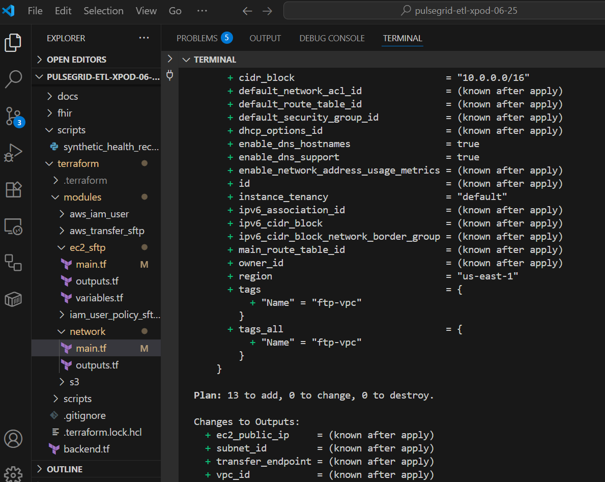

### terraform apply -auto-approve

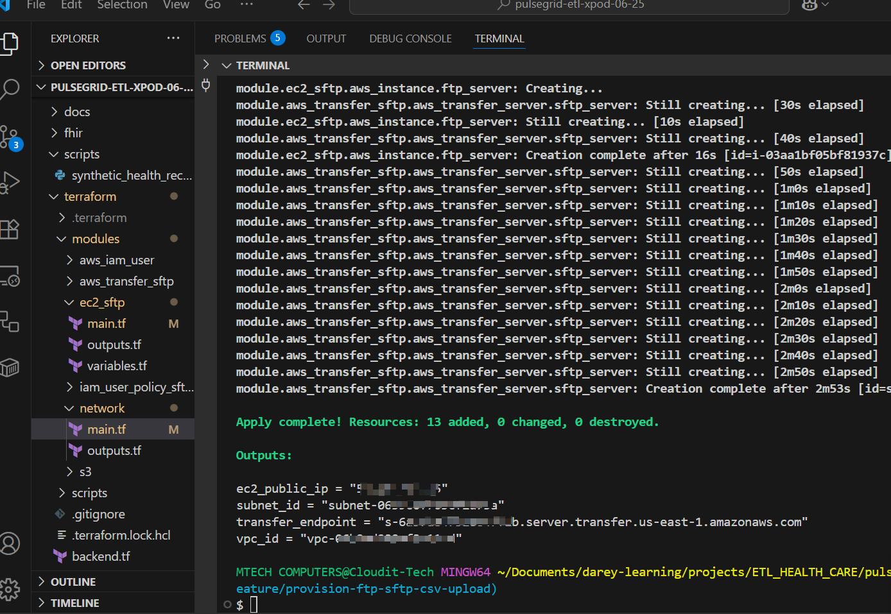

## CI/CD

### Error

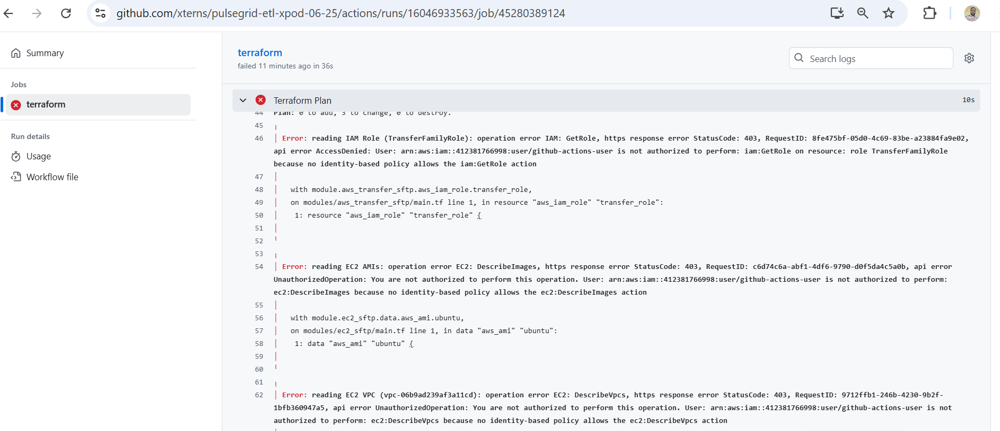

The errors are due to missing IAM permissions for the `github-actions-user`. To fix the `CI/CD` pipeline failure during terraform plan, I need to attach a policy that allows the following actions:

**Required IAM Permissions:**

Here’s a custom policy I can create and attach to the `github-actions-user:`

```json
{
  "Version": "2012-10-17",
  "Statement": [
    {
      "Sid": "EC2ReadAccess",
      "Effect": "Allow",
      "Action": [
        "ec2:DescribeImages",
        "ec2:DescribeVpcs",
        "ec2:DescribeAvailabilityZones"
      ],
      "Resource": "*"
    },
    {
      "Sid": "IAMReadAccess",
      "Effect": "Allow",
      "Action": [
        "iam:GetRole"
      ],
      "Resource": "*"
    }
  ]
}
```
Steps Taken:
- Create a new IAM policy ( `TerraformReadAccessPolicy`).

- Attach it to your github-actions-user.

### terraform apply -auto-approve

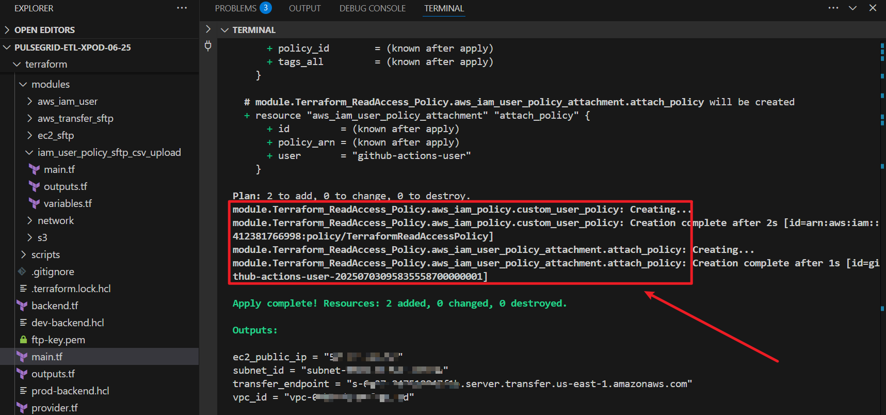

### - Re-run your GitHub Action workflow.

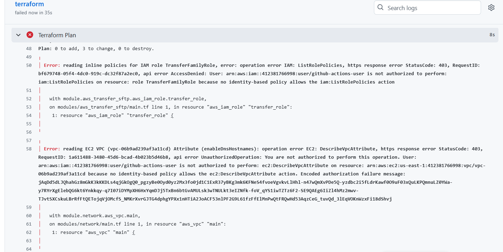

The new errors mean my IAM user `github-actions-user` needs additional permissions:

- `iam:ListRolePolicies` on the TransferFamilyRole IAM role
- `ec2:DescribeVpcAttribute` on your VPC resource


To fix this, I added these actions to my Terraform IAM policy. For example, extended my current `Terraform_ReadAccess_Policy` module like this:

```json
module "Terraform_ReadAccess_Policy" {
  source        = "./modules/iam_user_policy_sftp_csv_upload"
  policy_name   = "TerraformReadAccessPolicy"
  iam_user_name = var.iam_user_name
  description   = "Allow necessary read access for Terraform EC2 and IAM roles"

  policy_statements = [
    {
      Sid    = "EC2ReadAccess"
      Effect = "Allow"
      Action = [
        "ec2:DescribeImages",
        "ec2:DescribeVpcs",
        "ec2:DescribeAvailabilityZones",
        "ec2:DescribeVpcAttribute"
      ]
      Resource = "*"
    },
    {
      Sid    = "IAMReadAccess"
      Effect = "Allow"
      Action = [
        "iam:GetRole",
        "iam:ListRolePolicies"
      ]
      Resource = "*"
    }
  ]
}
```

**Why?**

- `iam:ListRolePolicies` allows Terraform to list inline policies attached to the IAM role (needed when managing or reading roles).

- `ec2:DescribeVpcAttribute` is required to get VPC attributes like enableDnsHostnames.

### After updating the policy, `re-apply` it to the IAM user, then run my `Terraform plan/apply again`.

### Error

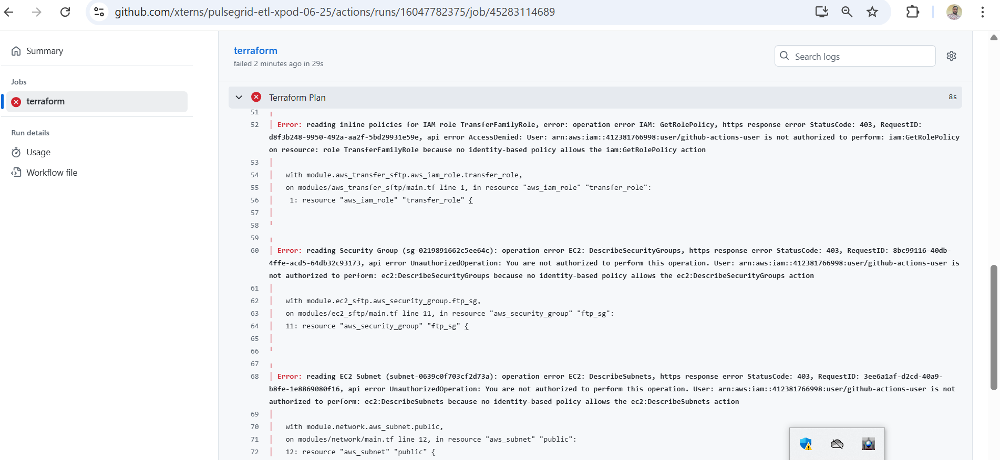

**Problem Summary:**

My Terraform run failed with errors like:

- `iam:GetRolePolicy` permission denied on the TransferFamilyRole.

- `ec2:DescribeSecurityGroups` permission denied.

- `ec2:DescribeSubnets` permission denied.

These errors indicate that the IAM user (`github-actions-user`) Terraform uses lacks permissions to read necessary AWS resources during plan/apply.

### How I Solved It Step-by-Step:

**1. Identified Missing Permissions:**

  The error messages clearly pointed to these missing permissions:
  -  `iam:GetRolePolicy` on the IAM role TransferFamilyRole
  -  `ec2:DescribeSecurityGroups` to read security group info.
  -  `ec2:DescribeSubnets` to read subnet details.

**2. Reviewed Existing IAM Policies:**

I had a policy module that attached some permissions to the IAM user, but these specific permissions were missing.

**3. Decided to Extend the Existing IAM Policy Module:**

Instead of creating a separate module for these permissions, you added them to your existing Terraform module responsible for IAM user policies — this keeps policies organized and manageable.

**4. Added the Required Actions to the IAM Policy Statements:**

Updated my IAM policy like this:

- Added `iam:GetRolePolicy` alongside other IAM read actions (`iam:GetRole, iam:ListRolePolicies`).

- Added `ec2:DescribeSecurityGroups` and `ec2:DescribeSubnets` alongside other EC2 read permissions (`ec2:DescribeImages, ec2:DescribeVpcs`, etc.).

**5. Applied the Updated Policy:**

I applied the Terraform changes, which updated the IAM policy attached to `github-actions-user` with the new permissions.

**6. Re-Ran Terraform Plan and Apply:**

### Error

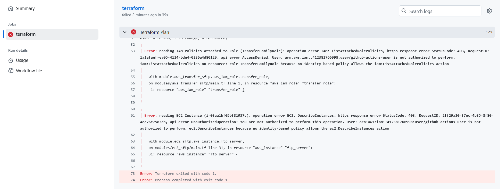

This error indicates the `github-actions-user` IAM user is missing two critical permissions needed by Terraform:

- `iam:ListAttachedRolePolicies` on the TransferFamilyRole IAM role

- `ec2:DescribeInstances` on EC2 instances

**How I fixed it:**

I need to add these permissions to the IAM policy attached to `github-actions-user`.

### Updated Terraform IAM policy snippet (add these permissions):

```json
module "aws_iam_user" {
  source        = "./modules/aws_iam_user"
  iam_user_name = var.iam_user_name
}

# Store AWS Access Key ID in GitHub repository secrets

resource "github_actions_secret" "aws_access_key_id" {
  repository      = var.github_repo
  secret_name     = "AWS_ACCESS_KEY_ID"
  plaintext_value = module.aws_iam_user.access_key_id
}

# Store AWS Secret Access Key in GitHub repository secrets
resource "github_actions_secret" "aws_secret_access_key" {
  repository      = var.github_repo
  secret_name     = "AWS_SECRET_ACCESS_KEY"
  plaintext_value = module.aws_iam_user.secret_access_key
}

####################################################################
# Project: Provision EC2 or AWS Transfer for SFTP CSV Upload (Spike)
####################################################################


module "network" {
  source = "./modules/network"
}

module "ec2_sftp" {
  source        = "./modules/ec2_sftp"
  instance_type = var.instance_type
  key_name      = var.key_name
  vpc_id        = module.network.vpc_id
  subnet_id     = module.network.subnet_id
  allowed_ips   = var.allowed_ips
}

module "aws_transfer_sftp" {
  source        = "./modules/aws_transfer_sftp"
  iam_role_name = var.iam_role_name
  s3_bucket     = var.s3_transfer_bucket
}

module "iam_user_policy_sftp_csv_upload" {
  source        = "./modules/iam_user_policy_sftp_csv_upload"
  policy_name   = "S3AccessPolicyForCSVUpload"
  iam_user_name = var.iam_user_name
  description   = "Policy to allow S3 access for CSV upload"

  policy_statements = [
    {
      Sid    = "AllowS3FullAccess"
      Effect = "Allow"
      Action = "s3:*"
      Resource = [
        "arn:aws:s3:::${var.clean_data_bucket}",
        "arn:aws:s3:::${var.clean_data_bucket}/*",
        "arn:aws:s3:::${var.raw_data_bucket}",
        "arn:aws:s3:::${var.raw_data_bucket}/*"
      ]
    }
  ]
}

module "iam_user_policy_transfer_tag" {
  source        = "./modules/iam_user_policy_sftp_csv_upload"
  policy_name   = "TransferTagPolicy"
  iam_user_name = var.iam_user_name
  description   = "Allow tagging for AWS Transfer Family server"

  policy_statements = [
    {
      Sid    = "AllowTransferTagging"
      Effect = "Allow"
      Action = [
        "transfer:TagResource",
        "transfer:CreateServer",
        "transfer:DescribeServer",
        "transfer:DeleteServer"
      ]
      Resource = "*"
    }
  ]
}

module "Terraform_ReadAccess_Policy" {
  source        = "./modules/iam_user_policy_sftp_csv_upload"
  policy_name   = "TerraformReadAccessPolicy"
  iam_user_name = var.iam_user_name
  description   = "Allow necessary read access for Terraform EC2 and IAM roles"

  policy_statements = [
    {
      Sid    = "EC2ReadAccess"
      Effect = "Allow"
      Action = [
        "ec2:DescribeImages",
        "ec2:DescribeVpcs",
        "ec2:DescribeAvailabilityZones",
        "ec2:DescribeVpcAttribute",
        "ec2:DescribeSecurityGroups",
        "ec2:DescribeSubnets",
        "ec2:DescribeInstances" # <--- Add this line
      ]
      Resource = "*"
    },

    {
      Sid    = "EC2DescribeInstanceTypes"
      Effect = "Allow"
      Action = [
        "ec2:DescribeInstanceTypes"
      ]
      Resource = "*"
    },

    {
      Sid    = "AllowEC2DescribeInstanceTypes"
      Effect = "Allow"
      Action = [
        "ec2:DescribeInstanceTypes"
      ]
      Resource = "*"
    },

    {
      Sid    = "AllowEC2DescribeTags"
      Effect = "Allow"
      Action = [
        "ec2:DescribeTags"
      ]
      Resource = "*"
    },

    {
      Sid    = "AllowDescribeInstanceAttribute",
      Effect = "Allow",
      Action = [
        "ec2:DescribeInstanceAttribute"
      ],
      Resource = "*"
    },

    {
      Sid    = "AllowDescribeVolumes",
      Effect = "Allow",
      Action = [
        "ec2:DescribeVolumes"
      ],
      Resource = "*"
    },

    {
      Sid    = "AllowDescribeInstanceCreditSpecifications",
      Effect = "Allow",
      Action = [
        "ec2:DescribeInstanceCreditSpecifications"
      ],
      Resource = "*"
    },

    {

      Sid    = "IAMReadAccess"
      Effect = "Allow"
      Action = [
        "iam:GetRole",
        "iam:ListRolePolicies",
        "iam:GetRolePolicy",
        "iam:ListAttachedRolePolicies" # <--- Add this line
      ]
      Resource = "*"
    }
  ]
}
```
Apply the updated policy so that Terraform can read the necessary IAM role and EC2 instance metadata during provisioning.

## Resolution of IAM Permission Issues for Terraform GitHub Actions Pipeline

### Issue:

During Terraform runs in the GitHub Actions pipeline, multiple AWS IAM permission errors occurred for the user `github-actions-user`. These errors prevented Terraform from reading necessary EC2 and IAM resources, resulting in failures such as:

- Unauthorized access to EC2 instance details (`DescribeInstanceTypes`, `DescribeTags`, `DescribeInstanceAttribute`, `DescribeVolumes`, `DescribeInstanceCreditSpecifications`)

- Unauthorized access to IAM role policies (`GetRolePolicy`, `ListAttachedRolePolicies`, etc.)

- Unauthorized access to EC2 network components (`Security Groups`, `Subnets`)

### Root Cause:

The `github-actions-user` IAM user lacked sufficient read permissions required by Terraform to query EC2 and IAM resources during plan and apply stages.

### Solution:

The IAM policy attached to the `github-actions-user` was updated to include the following AWS permissions:

- `ec2:DescribeInstanceTypes`

- `ec2:DescribeTags`

- `ec2:DescribeInstanceAttribute`

- `ec2:DescribeVolumes`

- `ec2:DescribeInstanceCreditSpecifications`

- `ec2:DescribeSecurityGroups`

- `ec2:DescribeSubnets`

- `iam:GetRolePolicy`

- `iam:ListAttachedRolePolicies`

- `iam:ListRolePolicies`

- `iam:GetRole`

- Other related read permissions required by Terraform modules

### Outcome:

After applying the updated IAM policy with these expanded permissions, the GitHub Actions `Terraform pipeline` **successfully** executed all stages including:

- Terraform init, validate, plan, and apply

- Proper querying of EC2 instances, IAM roles, and network resources

- No further authorization errors observed

This resolved all access-denied errors and allowed full automation of the infrastructure provisioning process through the pipeline.

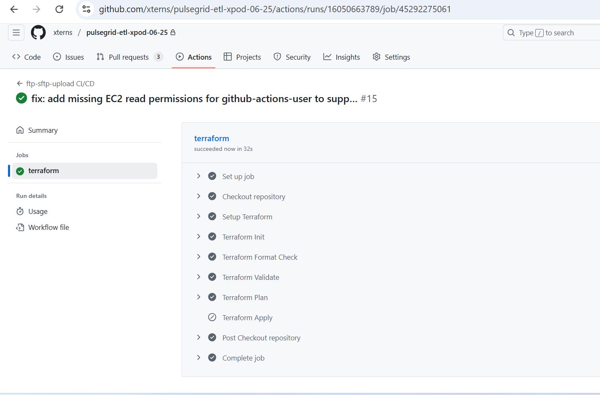

---

## Step: Move SSH Key to Default `.ssh` Directory and Connect to EC2

After successfully provisioning the EC2 instance, the `SSH` private key (`ftp-key.pem`) was located in the project directory. To standardize key management and enable easier SSH access, the key was moved to the user's default SSH directory:

```
ls -ld ~/.ssh

cp "/c/Users/MTECH COMPUTERS/Documents/darey-learning/projects/ETL_HEALTH_CARE/pulsegrid-etl-xpod-06-25/ftp-key.pem" ~/.ssh/
```

Next, the file permissions were verified or updated (if needed) to ensure they are secure enough for SSH:

```
chmod 400 ~/.ssh/ftp-key.pem
```


### Run `terraform apply` to provision additional network resources that facilitate SSH access to the instance.

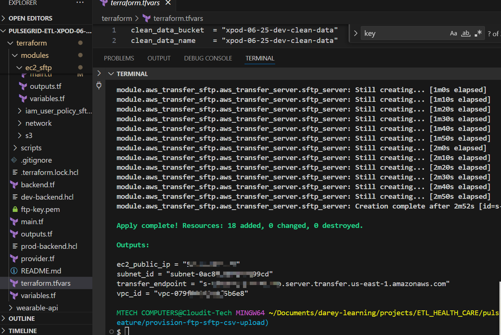

Finally, the EC2 instance was accessed using the simplified path:

```
ssh -i ~/.ssh/ftp-key.pem ubuntu@public_ip
```
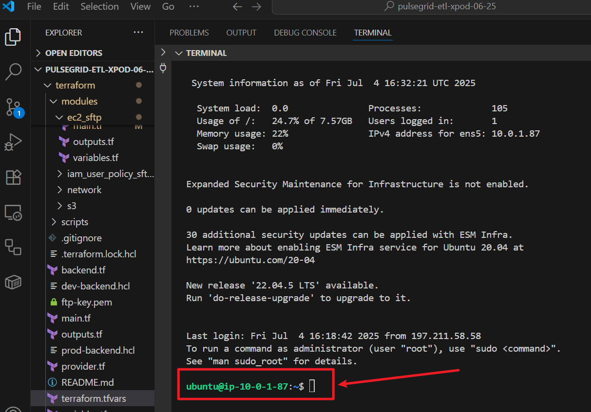

This approach avoids using a full path each time and aligns with common Linux/Unix practices for key storage.

---

## Section: Verifying FTP Server & Adding FTP Users

### Step 1: Confirm `vsftpd` is Running

**Purpose:**

Ensure the FTP service is properly installed and running before proceeding with user setup.

**Steps Taken:**

```bash
which vsftpd
sudo systemctl status vsftpd
ftp localhost
```
- This command checks the status of the `vsftpd` service (**Very Secure FTP Daemon**).

- If it's active (running), you can proceed to user setup.

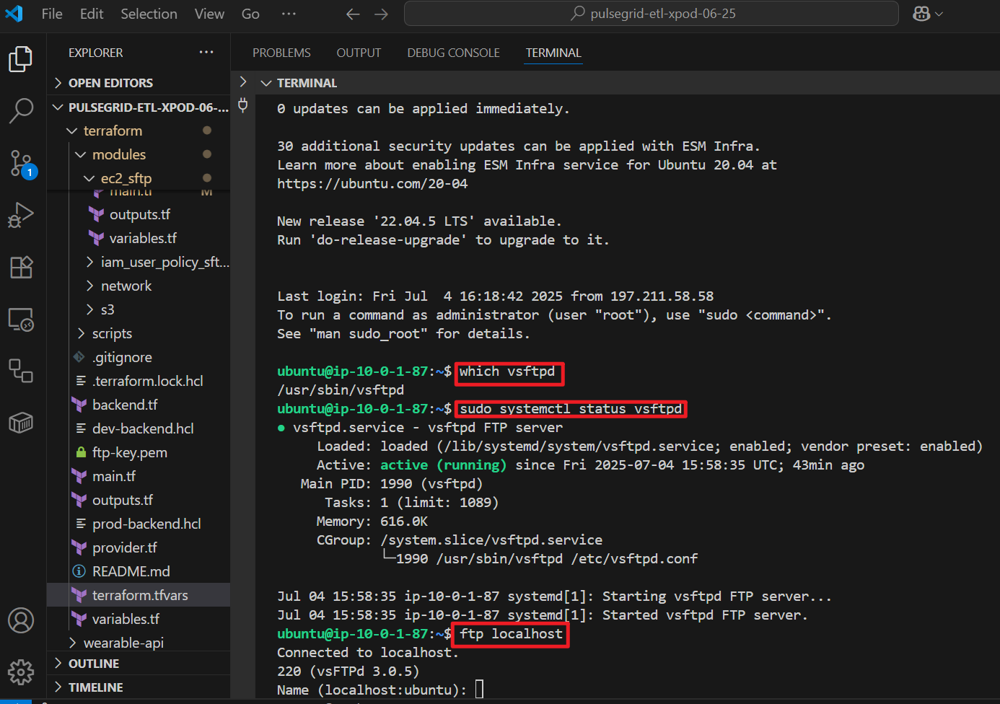

### Step 2: Add FTP User Accounts

**Purpose:**

Create dedicated Linux user accounts that will serve as FTP users with access to their respective directories.

**Steps Taken:**

To enable users to upload/download files:

1. Create a system user for FTP:
   
   ```bash
   sudo adduser ftpuser
   ```
  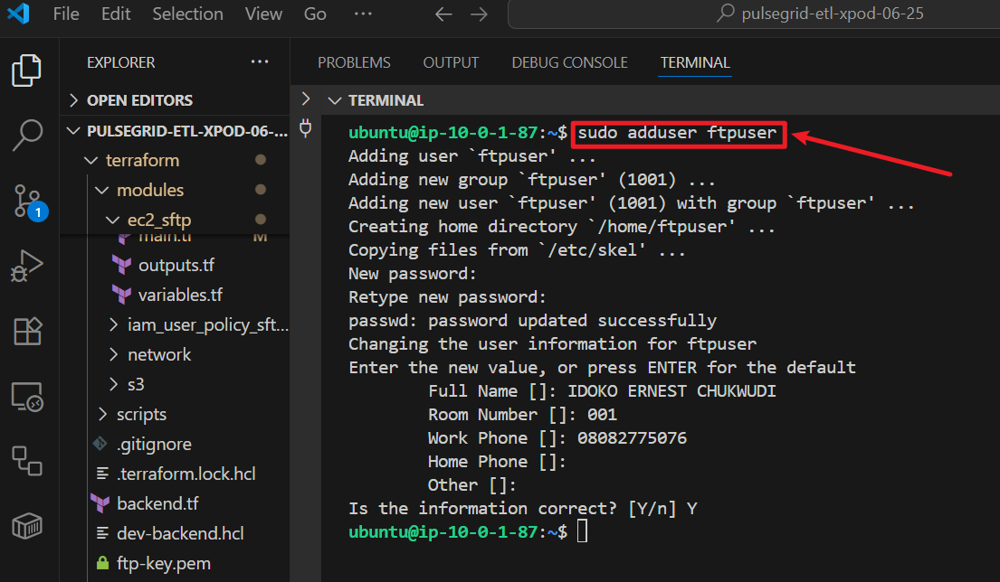

- This creates a user with a home directory.

- You are prompted to set a password and fill in user info.

2. Restrict SSH access:
To restrict this user to `FTP` only (no `SSH`), I would add their shell to `/etc/shells` or use `/sbin/nologin` depending on your distro and policy.

**Set user shell to `/usr/sbin/nologin`**

```bash
sudo usermod -s /usr/sbin/nologin ftpuser
```

### Step 3: Configure Directory Permissions

**Purpose:**

Ensure the FTP user has access only to their assigned directory, and secure the server by preventing navigation outside allowed paths.

**Steps Taken:**

1. Create a directory for uploads

```bash
sudo mkdir -p /home/ftpuser/uploads
```

2. Set ownership and permissions:

```bash
sudo chown ftpuser:ftpuser /home/ftpuser/uploads
sudo chmod 755 /home/ftpuser
sudo chmod 755 /home/ftpuser/uploads
```

Ensures user can write to uploads directory but not change parent settings.

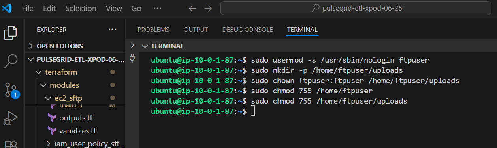

### Step 4: Test FTP Access

**Purpose:**

Confirm that the FTP user can connect and upload/download files using the server’s FTP service.

**Steps Taken:**

1. Create a Sample File for Upload

Still logged into the EC2 instance (as ubuntu or root), create a test file:

**Use `tee` with `sudo`**

```bash
echo "This is a test upload file for FTP server." | sudo tee /home/ftpuser/uploads/sample_upload.txt > /dev/null
```
This lets me write the file with elevated permissions without being blocked by the shell.

**OR Change Ownership or Permissions**

Since `ftpuser` owns the folder and I want `ubuntu` to write there, I could:

```bash
sudo chown ubuntu:ubuntu /home/ftpuser/uploads
```

1. Install FTP Client (If not present)

Since am testing FTP from the EC2 instance itself (using ftp localhost), I will install the FTP client:

```bash
sudo apt update && sudo apt install ftp -y
```

2. Test Local FTP Access (From EC2 to Itself)

```bash
ftp localhost
```

- Username: `ftpuser`

- Password: `password I set earlier`

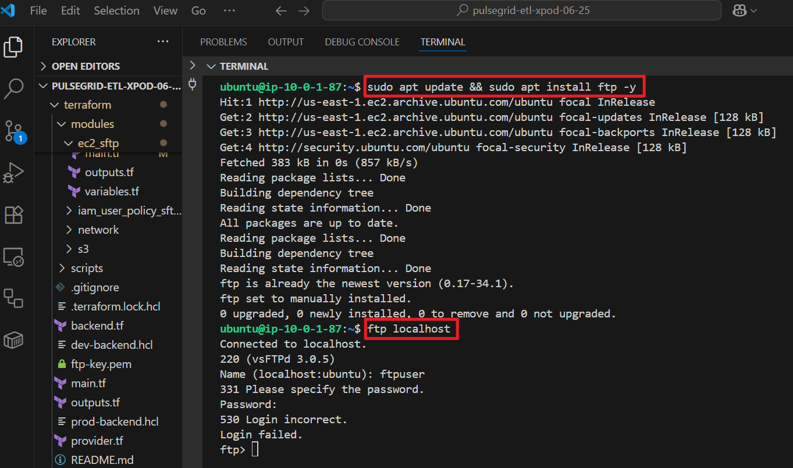


#### ❌ What’s Failing:

The login for `ftpuser` results in:

```bash
530 Login incorrect.
```

This strongly suggests:

`vsFTPd` is blocking users with `/usr/sbin/nologin` from logging in — depending on its configuration.

### Change the Shell Temporarily for Testing

Change from `/usr/sbin/nologin` to `/bin/bash` just for **testing**:

Then try logging in again:

```bash
ftp localhost
```

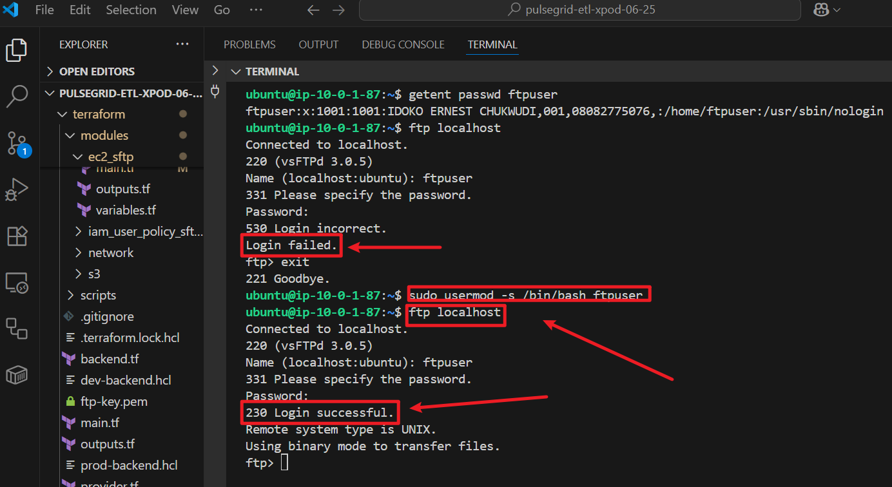

It works now, it means my `FTP server` is configured to reject `users` with `/usr/sbin/nologin`.

### Configure vsFTPd to Allow `/usr/sbin/nologin` Shells

I want to go back to using `/usr/sbin/nologin` (as I should for security), I will do this:

1. Open the vsftpd config:

```bash
sudo nano /etc/vsftpd.conf
```
Add or ensure these lines are present and uncommented:

```bash
pam_service_name=vsftpd
```

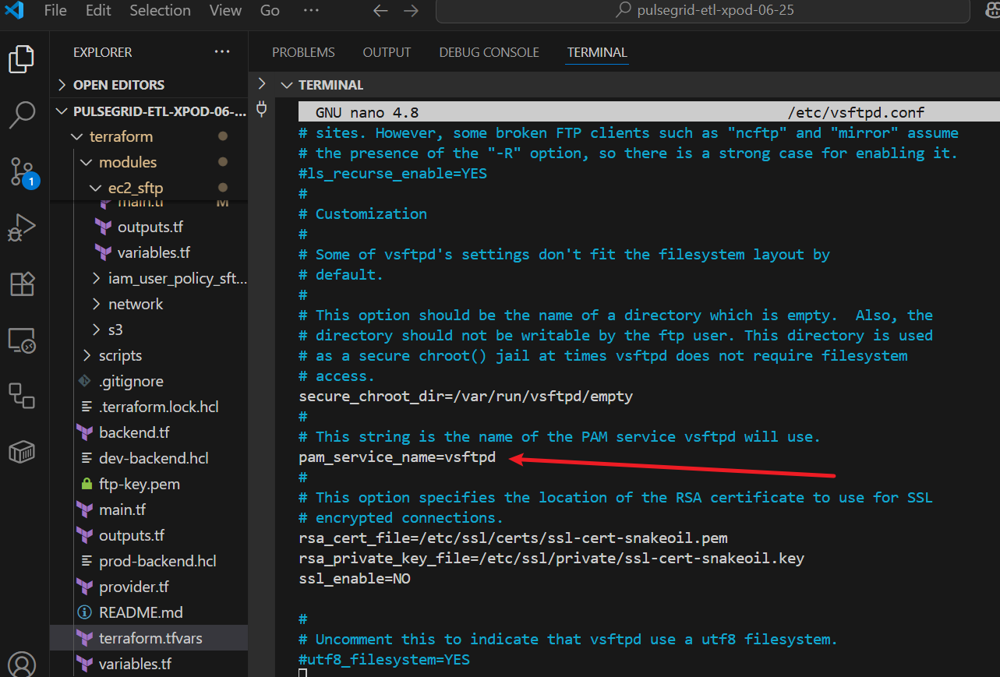

Then edit the PAM file:

```bash
sudo nano /etc/pam.d/vsftpd
```
Make sure this line is not blocking nologin (some distros do):

```bash
auth required pam_shells.so
```

If that line exists, **comment it out** like this:

```bash
#auth required pam_shells.so
```
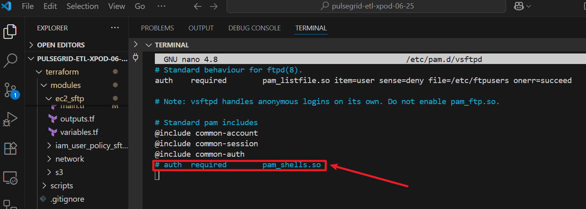

`pam_shells.so` restricts login to users with valid shells listed in `/etc/shells`.

Finally, restart `vsftpd`:

```bash
sudo systemctl restart vsftpd
```

### Retest FTP Login

After all this, switch `ftpuser` back to `/usr/sbin/nologin`:

```bash
sudo usermod -s /usr/sbin/nologin ftpuser
```
Then test again:

```bash
ftp localhost
```

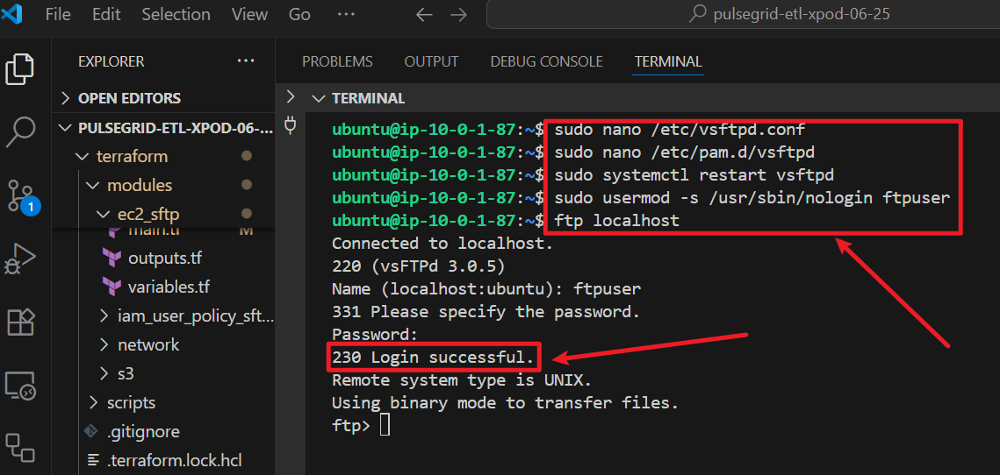

**Once connected:**

```bash
ls                        # List files
cd uploads                # Navigate to uploads folder
put sample_upload.txt     # Upload a file
get sample_upload.txt     # Download the same file
bye                       # Exit FTP session
```
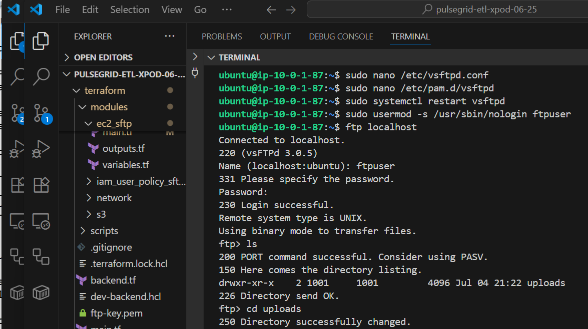

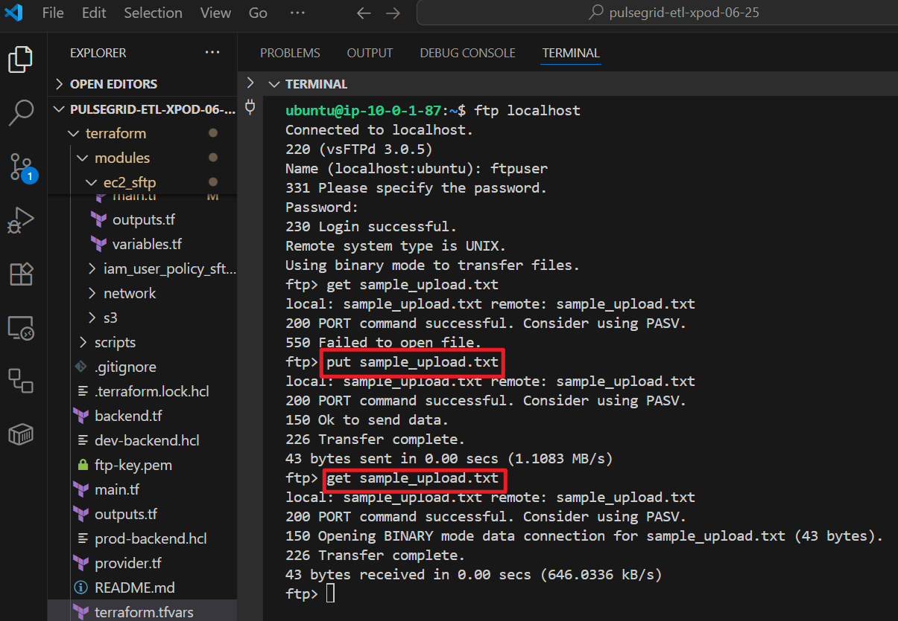

---

### Test Remote FTP Access (From Your Local Machine)

On my local machine (`PowerShell`, `Terminal`, or `Git Bash`):

```bash
ftp <public-ip-address-of-ec2>
```

Enter:

- Name: ftpuser

- Password: same as set on server.

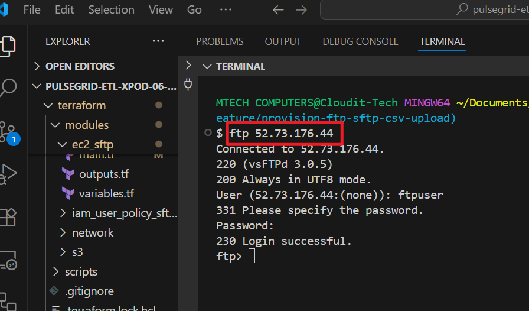

### Prepare a file to `upload`:

```bash
echo "This is a local upload test file." > localfile.txt
```

Then from the FTP prompt:

```bash
ls                         # See available files
cd uploads                 # Go into uploads folder
get sample_upload.txt      # Download it to your local machine
put localfile.txt          # Upload a file (you must have this file in your current directory)
bye                        # Exit
```

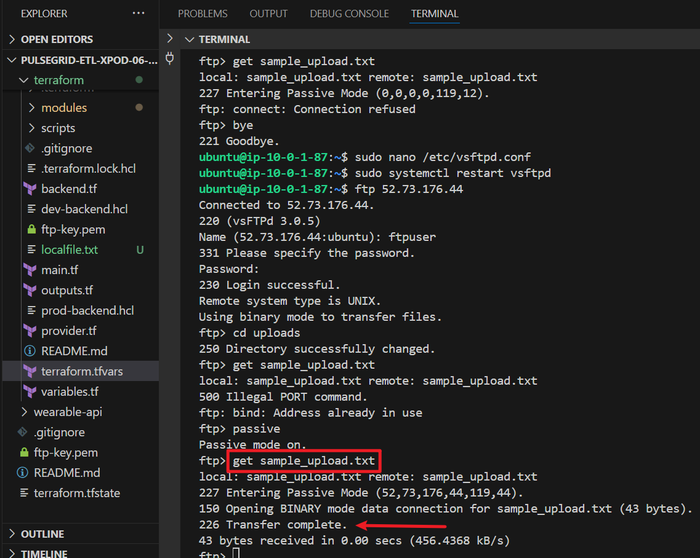

### FTP Passive Mode Resolution Summary

#### Configuration Fixes:

**1. Disabled IPv6-only mode**
   
   - Set `listen_ipv6=NO` in `/etc/vsftpd.conf`
**2. Enabled IPv4 listening**
   
   - Set `listen=YES` to allow standard IPv4 connections

**Set passive mode options:**

```bash
pasv_enable=YES
pasv_min_port=30000
pasv_max_port=31000
pasv_address=52.73.176.44  # Your EC2 public IP
```
**4. Restarted `vsftpd` to apply changes:**

```bash
sudo systemctl restart vsftpd
```
#### EC2 Security Group Updates:

- Allowed TCP ports `30000–31000` (FTP passive data)

- Opened ports to your IP or `0.0.0.0/0` for public testing

### Final Result:

- FTP user `ftpuser` can now upload (`put`) and download (`get`) files

- Passive mode connections succeed with correct `public IP`

- Transfers work externally (tested with IP: `52.73.176.44`)


---

On Windows and FTP via GUI (e.g., FileZilla), connect using:

- Host: Public IP of your EC2

- Username: ftpuser

- Password: set password

- Port: 21


### NOTE: Forgot password

#### Check User Exists and Has a Valid Home Directory

```bash
getent passwd ftpuser
```

```bash
sudo passwd ftpuser
```

## Transition to Dynamic Terraform-Managed SSH Keys for Multiple Users

### Step 0: Clean Up Previously Created SSH Keys

**Purpose:** To avoid key mismatch or confusion, I deleted the manually created `ftp-key` from AWS EC2 and local `.pem` file so I can switch completely to a fully Terraform-managed SSH key strategy.

**Steps Taken:**

- Deleted the key from AWS using AWS CLI.

- Removed the .pem file from my machine.

```bash
# Delete existing key from AWS EC2
aws ec2 delete-key-pair --key-name ftp-key --region us-east-1

# Optionally delete the local PEM file
rm -f ~/.ssh/ftp-key.pem
```

## SSH Key Generation + SFTP User Provisioning (Terraform)

### 1. Create `modules/ssh_key_pair/main.tf`

**Purpose**

To automate the secure generation of SSH key pairs (public/private) for SFTP users using Terraform. This ensures consistency, avoids manual steps, and supports multi-user dynamic creation.

**Steps Taken**

I created a reusable Terraform module to:

- Generate a unique SSH key pair for each user.

- Register public keys in AWS (optional).

- Save the private keys securely to the .ssh folder for access.

#### `modules/ssh_key_pair/main.tf`

```hcl
# ==========================================
# Generate SSH Private Key Using TLS Provider
# ==========================================
resource "tls_private_key" "ssh_key" {
  for_each = var.users
  algorithm = "RSA"
  rsa_bits  = 2048
}

# ==========================================
# Register Public Key with AWS (Optional)
# ==========================================
resource "aws_key_pair" "key" {
  for_each   = var.users
  key_name   = each.key
  public_key = tls_private_key.ssh_key[each.key].public_key_openssh
}

# ==========================================
# Save Private Key Locally in .ssh Directory
# ==========================================
resource "local_file" "private_key" {
  for_each        = var.users
  content         = tls_private_key.ssh_key[each.key].private_key_pem
  filename        = "${path.module}/../../.ssh/${each.key}.pem"
  file_permission = "0600"
}
```

#### `modules/ssh_key_pair/variables.tf`

```hcl
variable "users" {
  description = "Map of users to generate SSH key pairs for"
  type        = map(any)
}
```

#### modules/ssh_key_pair/outputs.tf

```hcl
output "public_keys" {
  value = {
    for user, key in tls_private_key.ssh_key :
    user => key.public_key_openssh
  }
}

output "private_key_files" {
  value = {
    for user, file in local_file.private_key :
    user => file.filename
  }
}
```

---

### Call the Module in Your Root `main.tf`

**Purpose**

To generate SSH keys for **users** `ernest` and `idoko` and make their public keys available for provisioning in SFTP server configuration.

**Steps Taken**

I called the `ssh_key_pair` module in the root `main.tf` using a map of usernames.

#### root `main.tf`

```hcl
# ==========================================
# SSH Key Pair Module for SFTP Users
# ==========================================
module "ssh_key_pair" {
  source = "./modules/ssh_key_pair"
  users  = var.sftp_users
}
```

#### Add `sftp_users` to `variables.tf`

#### root `variables.tf`

```hcl
variable "sftp_users" {
  description = "Map of SFTP users and their properties"
  type        = map(any)
}
```

#### Define Users in `terraform.tfvars`

### root `terraform.tfvars`

```hcl
sftp_users = {
  ernest = {}
  idoko  = {}
}
```

---

### Use Public Keys to Provision AWS Transfer Family SFTP Users

**Purpose**

To create AWS-managed SFTP users using the public keys generated by the module and store their files in the raw data bucket.

**Steps Taken**

I extended the `aws_transfer_sftp` module to:

- Use the `aws_transfer_server` already created.

- Assign SFTP access to each user.

- Point their home directory to a `user-specific` path within the raw S3 bucket.

- Use their generated public key.

### Update `modules/aws_transfer_sftp/main.tf`

```hcl
# ==========================================
# Provision AWS Transfer Family SFTP Users
# ==========================================
resource "aws_transfer_user" "sftp_users" {
  for_each = var.sftp_users

  server_id           = aws_transfer_server.sftp_server.id
  user_name           = each.key
  role                = aws_iam_role.transfer_role.arn
  home_directory      = "/${var.s3_bucket}/${each.key}"
  ssh_public_key_body = module.ssh_key_pair.public_keys[each.key]

  tags = {
    Name        = each.key
    Environment = var.env
  }
}
```

#### Update `modules/aws_transfer_sftp/variables.tf`

```hcl
variable "sftp_users" {
  description = "Map of usernames and properties for Transfer Family"
  type        = map(any)
}

variable "env" {
  description = "Environment name (e.g., dev, prod)"
  type        = string
}

# variable "ssh_key_pair_module" {
#  description = "Reference to ssh_key_pair module"
#  type        = any
# }

# ==========================================
# SSH Public Keys for SFTP Users (Map)
# ==========================================
variable "ssh_public_keys" {
  description = "Map of usernames to their SSH public keys"
  type        = map(string)
}
```

#### Update `modules/aws_transfer_sftp/outputs.tf`

```hcl
output "sftp_usernames" {
  value = keys(var.sftp_users)
}
```

#### Pass Module Output in Root `main.tf`

**Update existing call:**

```hcl
module "aws_transfer_sftp" {
  source              = "./modules/aws_transfer_sftp"
  iam_role_name       = var.iam_role_name
  s3_bucket           = var.raw_data_bucket
  sftp_users          = var.sftp_users
  env                 = var.env
  ssh_key_pair_module = module.ssh_key_pair
}
```

**Run:**

```hcl
terraform init -reconfigure
```

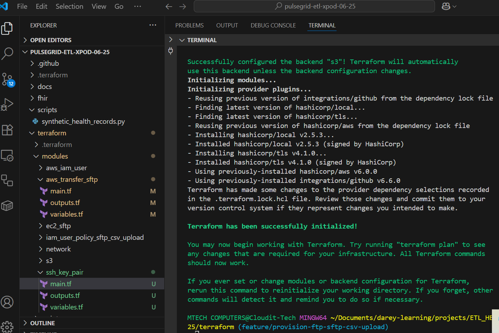

```hcl
terraform validate
```

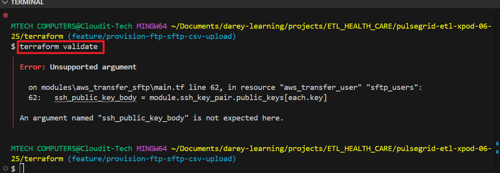

The `ssh_public_key_body` argument was **deprecated** in newer AWS provider versions, and instead, **public keys** for Transfer Family users are now managed using a separate resource: `aws_transfer_ssh_key`.

### **How to Fix This**

We’ll need to:

- Remove the `ssh_public_key_body` from the `aws_transfer_user`.

- Add a new `aws_transfer_ssh_key` resource to link the SSH key after the user is created.

### **Step-by-Step Fix**

#### 1. Update `aws_transfer_user` Resource

In `modules/aws_transfer_sftp/main.tf`, remove the `ssh_public_key_body` line:

```hcl
# ==========================================
# Provision AWS Transfer Family SFTP Users
# ==========================================
resource "aws_transfer_user" "sftp_users" {
  for_each = var.sftp_users

  server_id      = aws_transfer_server.sftp_server.id
  user_name      = each.key
  role           = aws_iam_role.transfer_role.arn
  home_directory = "/${var.s3_bucket}/${each.key}"

  tags = {
    Name        = each.key
    Environment = var.env
  }
}
```

#### 2. Add New Resource: `aws_transfer_ssh_key`

Also in `modules/aws_transfer_sftp/main.tf`, add below the user resource:

```hcl
# ==========================================
# Add SSH Key for Transfer Family SFTP Users
# ==========================================
resource "aws_transfer_ssh_key" "sftp_user_keys" {
  for_each = var.sftp_users

  server_id = aws_transfer_server.sftp_server.id
  user_name = aws_transfer_user.sftp_users[each.key].user_name
  body      = module.ssh_key_pair.public_keys[each.key]
}
```

**Why This Change?**

Starting from AWS provider v5.x+, `aws_transfer_user` no longer accepts `ssh_public_key_body`. Instead, **SSH keys** are managed using `aws_transfer_ssh_key`, allowing multiple keys per user and better lifecycle separation.

Once updated, run:

```hcl
terraform init
terraform validate
```

### Error

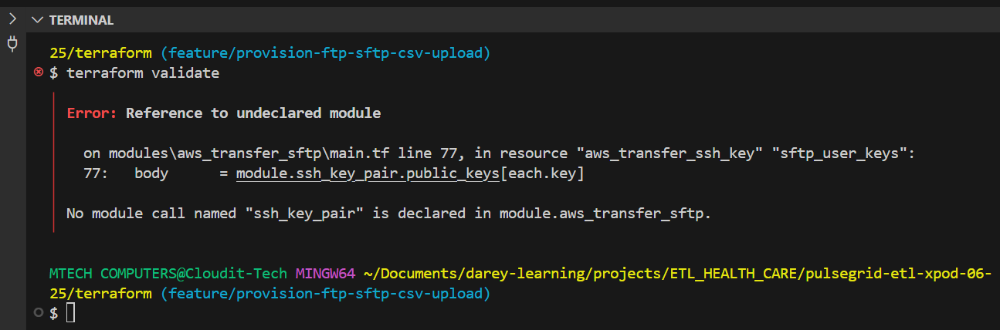

The problem is that I am referencing the `ssh_key_pair` module inside my `aws_transfer_sftp` module, but that module isn’t declared or passed into it.

**Solution**

To keep my project modular and DRY, I should pass in the public SSH keys from the `ssh_key_pair` module into my `aws_transfer_sftp` module as a **variable**.

### Let’s fix this step by step.

#### Step 1: Update `aws_transfer_sftp` Module to Accept SSH Public Keys

#### Edit `modules/aws_transfer_sftp/variables.tf` to include:

```hcl
# ==========================================
# SSH Public Keys for SFTP Users (Map)
# ==========================================
variable "ssh_public_keys" {
  description = "Map of usernames to their SSH public keys"
  type        = map(string)
}
```

Then update my `aws_transfer_sftp/main.tf` to use the variable instead of referencing the undeclared module:

```hcl
# ==========================================
# Add SSH Key for Transfer Family SFTP Users
# ==========================================
resource "aws_transfer_ssh_key" "sftp_user_keys" {
  for_each = var.sftp_users

  server_id = aws_transfer_server.sftp_server.id
  user_name = aws_transfer_user.sftp_users[each.key].user_name
  body      = var.ssh_public_keys[each.key]  # ✅ Now using the input variable
}
```

#### Step 2: Update Root `main.tf` to Pass in the Public Keys

Update my root `main.tf` where I declare the `aws_transfer_sftp` module to pass the public keys:

```hcl
module "aws_transfer_sftp" {
  source           = "./modules/aws_transfer_sftp"
  iam_role_name    = var.iam_role_name
  s3_bucket        = var.raw_data_bucket  # or clean_data_bucket, as discussed
  ssh_public_keys  = module.ssh_key_pair.public_keys  # ✅ Pass in the keys
  sftp_users       = var.sftp_users
}
```

#### Step 3: Make Sure `sftp_users` Variable is Declared in Root

In my root `terraform.tfvars` define:

```hcl
sftp_users = {
  idoko = {
    public_key_path = "./.ssh/idoko.pub"
  },
  ernest = {
    public_key_path = "./.ssh/ernest.pub"
  }
}
```

#### Step 4: `Re-Run` Terraform Commands

Now Run:

```hcl
terraform validate
terraform plan
terraform apply -auto-approve
```

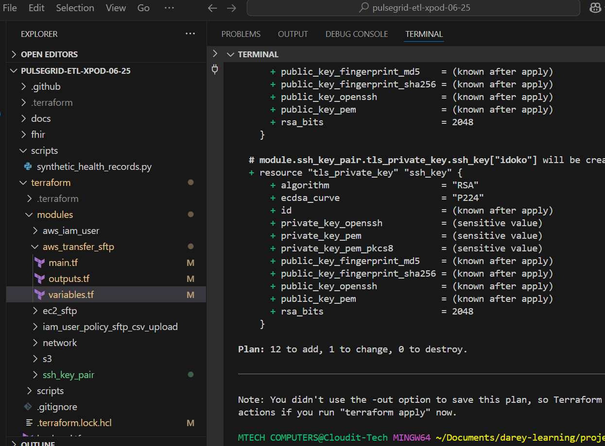

### terraform apply -auto-approve - RROR

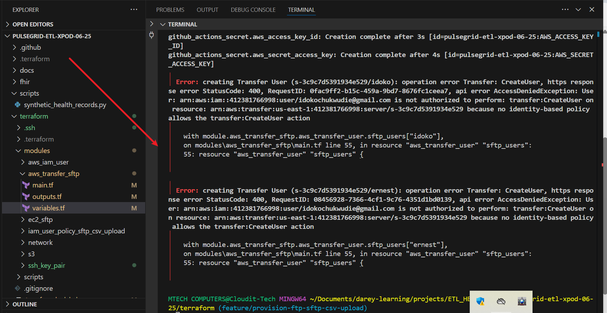

```pgsql
AccessDeniedException: User: arn:aws:iam::412381766998:user/idokochukwudie@gmail.com is not authorized to perform: transfer:CreateUser
```

**Root Cause**

The IAM user I am using to run `terraform apply` does not have **permission** to perform the action `transfer:CreateUser` on the **Transfer Family Server**.

Terraform is trying to create AWS Transfer Family users (like **idoko and ernest**), but the IAM user I'am authenticated with (`idokochukwudie@gmail.com`) isn't authorized to do that.

**Solution**

I must attach a policy to my **IAM user** to allow `transfer:CreateUser` (and related actions). Here's how:

**Step 1: Add Missing Policy**

Since this module `modules/iam_user_policy_sftp_csv_upload/main.tf` is already built to accept **dynamic policy statements** via `var.policy_statements`, I do not need to create a new module. I can reuse this same module by calling it again from my root `main.tf`, this is already how I've used it for multiple IAM-related policies.

**What I should do**

I will add a new instance of that module in my root `main.tf`, specifically for allowing the `transfer:CreateUser` and related permissions.

**Implementation**

**Purpose:**

To grant the authenticated IAM user sufficient permission to manage **AWS Transfer Family users** (`create`, `update`, `delete`, `list`). This is required to provision SFTP users programmatically using Terraform.

**Steps Taken:**

I extended the existing IAM user policy configuration by creating a new instance of the reusable `iam_user_policy_sftp_csv_upload` module. This new instance defines a policy (`TransferUserManagementPolicy`) that allows key AWS Transfer Family user management actions.

#### Add to my `main.tf` (Root)

```hcl
# ===================================================
# IAM Policy Module: Allow Transfer Family User Management
# ===================================================

module "iam_user_policy_transfer_user_management" {
  source        = "./modules/iam_user_policy_sftp_csv_upload"
  policy_name   = "TransferUserManagementPolicy"
  iam_user_name = var.iam_user_name
  description   = "Allow managing AWS Transfer Family users"

  policy_statements = [
    {
      Sid    = "AllowTransferUserManagement"
      Effect = "Allow"
      Action = [
        "transfer:CreateUser",
        "transfer:UpdateUser",
        "transfer:DeleteUser",
        "transfer:ListUsers"
      ]
      Resource = "arn:aws:transfer:${var.region}:${data.aws_caller_identity.current.account_id}:server/*"
    }
  ]
}
```

#### create `data.tf` (root)

```hcl
# =====================================================
# Retrieve AWS Account ID for use in IAM policy ARNs
# =====================================================
data "aws_caller_identity" "current" {}
```

#### Defined:

```hcl
variable "region" {
  description = "AWS Region"
  type        = string
}

# in terraform.tfvars
region = "us-east-1"
```

Once I had added the module to `main.tf`, run:

```hcl
terraform validate
terraform plan
terraform apply -auto-approve
```

## Summary: Resolving `AccessDeniedException` for `transfer:DescribeUser` on AWS Transfer Family Users

**Problem Statement:**

Terraform was failing to manage `aws_transfer_user` resources with the error:

```hcl
AccessDeniedException: User ... is not authorized to perform: transfer:DescribeUser on resource: ...
```
Despite an IAM policy being attached, the error persisted because the policy did not explicitly cover the full ARN structure used by AWS Transfer Family users.

### Steps Taken to Resolve the Issue:

#### 1. Updated IAM Policies to Include Missing Permissions

I updated the two IAM policy modules:

- `TransferUserManagementPolicy`

- `TransferUserManagementPolicyForMe`

To include the required actions and ARNs:

**Actions Added:**

```json
[
  "transfer:DescribeUser",
  "transfer:ImportSshPublicKey",
  "transfer:DeleteSshPublicKey",
  "transfer:ListSshPublicKeys",
  "transfer:TagResource",
  "transfer:UntagResource",
  "transfer:DescribeServer",
  "transfer:ListTagsForResource"
]
```

**Resource ARNs Updated:**

```hcl
Resource = [
  "arn:aws:transfer:${var.region}:${data.aws_caller_identity.current.account_id}:server/*",
  "arn:aws:transfer:${var.region}:${data.aws_caller_identity.current.account_id}:user/*",
  "arn:aws:transfer:${var.region}:${data.aws_caller_identity.current.account_id}:user/*/*" # <-- crucial fix
]
```

#### 2. Applied IAM Policy Modules Separately

Terraform tries to read (`DescribeUser`) existing `aws_transfer_user` resources during plan. If the required permissions are not yet active, the plan fails.

To resolve this, we ran:

```hcl
terraform apply -target=module.iam_user_policy_transfer_user_management
terraform apply -target=module.iam_user_policy_transfer_user_management_me
```

This ensured that only the IAM policies were applied first, giving AWS time to propagate the new permissions.

### 3. Ran Full Terraform Plan and Apply

After the IAM changes took effect, we re-ran:

```hcl
terraform plan
terraform apply
```

This time, the plan succeeded without AccessDeniedException errors, and the aws_transfer_user resources were properly managed.

**Outcome:**

The permission issue was resolved, and the Terraform deployment was successful. The user `idokochukwudie@gmail.com` can now manage AWS Transfer Family users as intended.

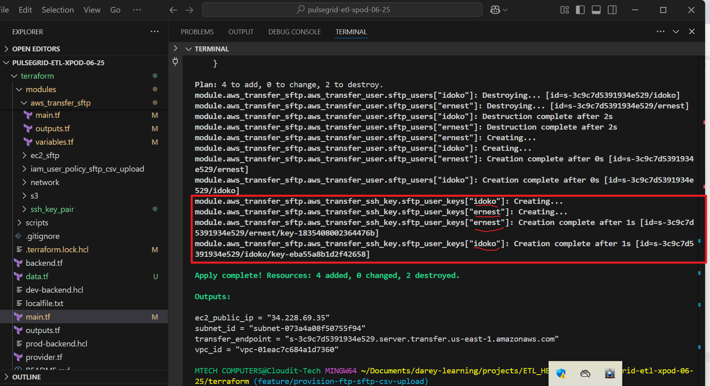


## Refactoring IAM Policy Module for AWS Transfer Family Using for_each

### Purpose

The goal of this refactoring was to simplify and scale the Terraform configuration managing IAM policies that grant permissions to work with AWS Transfer Family users (SFTP). Instead of duplicating policy definitions for each IAM user, I used the `for_each` construct to dynamically assign consistent permissions across multiple users.

### What Was Done (Step-by-Step)

#### Step 1: Defined IAM Users and Policy Names in a Map

Created a map variable `iam_user_policy_map` in `terraform.tfvars` or `variables.tf` to pair IAM usernames with policy names.

**Root terraform.tfvars**

```hcl
iam_user_policy_map = {
  "github-actions-user"         = "TransferUserManagementPolicy-github"
  "idokochukwudie@gmail.com"    = "TransferUserManagementPolicy-idoko"
}
```

#### Step 2: Declared the Variable in `variables.tf`

Added a new variable block to accept the map of IAM usernames and policy names.

```hcl
variable "iam_user_policy_map" {
  description = "Map of IAM usernames to policy names"
  type        = map(string)
}
```

#### Step 3: Replaced Duplicate IAM Policy Blocks with a Dynamic Module

Used `for_each` in the module "`iam_user_policy_transfer_user_management`" block to iterate through the map and create policies per user.

```hcl
##############################################################################
# IAM Policy Module: Allow Transfer Family User Management for SFTP Users
##############################################################################
# This module attaches IAM policies to allow managing AWS Transfer Family users,
# including operations like creating, updating, deleting users, and handling SSH keys.
# It uses a dynamic map (iam_user_policy_map) to apply policies per user,
# and assigns a unique IAM policy name for each user to avoid conflicts.
##############################################################################

module "iam_user_policy_transfer_user_management" {
  source        = "./modules/iam_user_policy_sftp_csv_upload"
  for_each      = var.iam_user_policy_map

  # Unique policy name per user to avoid naming conflicts
  policy_name   = "TransferUserManagementPolicy-${each.key}"

  iam_user_name = each.key
  description   = "Allow managing AWS Transfer Family users for ${each.key}"

  policy_statements = [
    {
      Sid    = "AllowTransferUserManagement"
      Effect = "Allow"
      Action = [
        "transfer:CreateUser",
        "transfer:UpdateUser",
        "transfer:DeleteUser",
        "transfer:ListUsers",
        "transfer:DescribeUser",
        "transfer:ImportSshPublicKey",
        "transfer:DeleteSshPublicKey",
        "transfer:ListSshPublicKeys",
        "transfer:TagResource",
        "transfer:UntagResource",
        "transfer:DescribeServer",
        "transfer:ListTagsForResource"
      ]
      Resource = [
        "arn:aws:transfer:${var.region}:${data.aws_caller_identity.current.account_id}:server/*",
        "arn:aws:transfer:${var.region}:${data.aws_caller_identity.current.account_id}:user/*",
        "arn:aws:transfer:${var.region}:${data.aws_caller_identity.current.account_id}:user/*/*"
      ]
    }
  ]
}
```
#### Step 4: Removed Redundant Code

Deleted the older hardcoded blocks for `TransferUserManagementPolicy` and `TransferUserManagementPolicyForMe`.

RUN:

```hcl
terraform apply -target=module.iam_user_policy_transfer_user_management
```

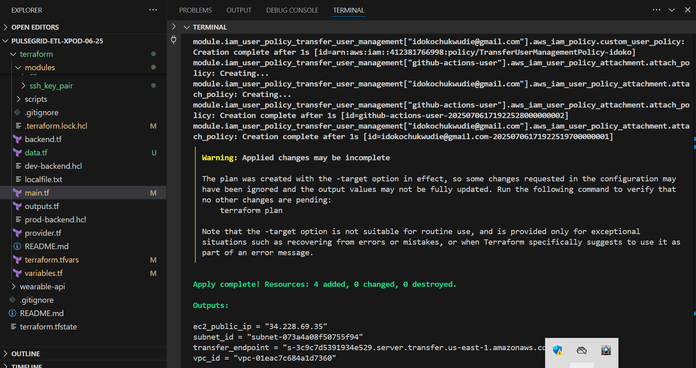


### Testing the AWS Managed SFTP Setup with `ernest` and `idoko`

**Purpose**

To verify that:

1. The AWS Transfer Family (`SFTP`) server is correctly set up.
2. The users (`ernest`, `idoko`) can securely authenticate using their respective **SSH keys**.
3. Files (specifically `.csv`) can be uploaded to and retrieved from the **raw S3 bucket**.
4. The permissions and bucket mapping are correctly configured.

#### Step 1: List SSH Public Keys on AWS Console

**Purpose:**

To ensure that Terraform successfully uploaded the public SSH keys for each user (`ernest`, `idoko`) to the AWS Transfer Family.

**Steps Taken:**

Terraform created and registered public SSH keys for each user. You can confirm this via the AWS Console:

- Go to **AWS Transfer Family** > **Users**

- Select each user (`ernest`, `idoko`)

- Under SSH public keys, confirm fingerprint and creation time

## Error

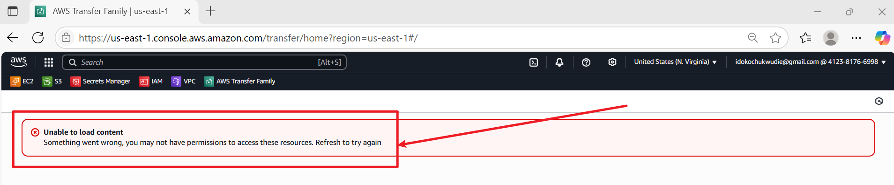

**Reason**

This error typically occurs when your IAM user or role lacks permissions required by the AWS Console UI itself — even though CLI works.

The AWS Console often uses additional API calls (like `List*`, `Describe*`, `Get*` for `roles`, `tags`, and `CloudTrail`) behind the scenes to load UI components — even for viewing a page, not just performing an action.

### Fix: Add Additional Console-Friendly Permissions

To resolve this, I will extend my IAM policy to include:

### Missing (Required for Console)

These are actions not in your policy that are used by the AWS Console to load and render pages:

| **Missing Action**                   | **Why It's Needed**                                               |
|-------------------------------------|-------------------------------------------------------------------|
| `transfer:ListServers`              | Console tries to list Transfer Family servers                     |
| `iam:GetRole`                       | To resolve the IAM roles assigned to users                        |
| `iam:ListRoles`                     | Console populates role dropdowns or details                       |
| `iam:GetUser`                       | To show the details of IAM users                                  |
| `iam:ListUsers`                     | Console might try to list users (e.g. audit)                      |
| `iam:ListAttachedUserPolicies`      | For showing attached policies in console                          |
| `iam:GetPolicy`                     | To read details of managed policies                               |
| `iam:ListPolicies`                  | For listing policies in dropdowns                                 |

Here's my updated Terraform configuration block with additional necessary permissions to support both `CLI` and **AWS Console operations** for **AWS Transfer Family** and **IAM resources**. These additions will help avoid the Unable to load content issue in the console and prevent further access errors.

```hcl
##############################################################################
# IAM Policy Module: Allow Transfer Family User Management for SFTP Users
##############################################################################
# This module attaches IAM policies to allow managing AWS Transfer Family users,
# including operations like creating, updating, deleting users, and handling SSH keys.
# It also includes extra IAM and Transfer permissions needed for Console access.
##############################################################################
module "iam_user_policy_transfer_user_management" {
  source   = "./modules/iam_user_policy_sftp_csv_upload"
  for_each = var.iam_user_policy_map

  policy_name   = each.value
  iam_user_name = each.key
  description   = "Allow managing AWS Transfer Family users"

  policy_statements = [
    {
      Sid    = "AllowTransferUserManagement"
      Effect = "Allow"
      Action = [
        # Transfer Family user operations
        "transfer:CreateUser",
        "transfer:UpdateUser",
        "transfer:DeleteUser",
        "transfer:ListUsers",
        "transfer:DescribeUser",
        "transfer:ImportSshPublicKey",
        "transfer:DeleteSshPublicKey",
        "transfer:ListSshPublicKeys",
        "transfer:TagResource",
        "transfer:UntagResource",
        "transfer:DescribeServer",
        "transfer:ListTagsForResource",
        "transfer:ListServers",               # Needed for Console UI
        # IAM permissions for resolving role/user details in Console
        "iam:GetRole",
        "iam:ListRoles",
        "iam:GetUser",
        "iam:ListUsers",
        "iam:ListAttachedUserPolicies",
        "iam:GetPolicy",
        "iam:ListPolicies"
      ]
      Resource = [
        # Transfer Family resources
        "arn:aws:transfer:${var.region}:${data.aws_caller_identity.current.account_id}:server/*",
        "arn:aws:transfer:${var.region}:${data.aws_caller_identity.current.account_id}:user/*",
        "arn:aws:transfer:${var.region}:${data.aws_caller_identity.current.account_id}:user/*/*",
        # IAM resources (required for List/Get actions in Console UI)
        "*"
      ]
    }
  ]
}
```
#### Re-run:

```hcl
terraform apply -auto-approve
```

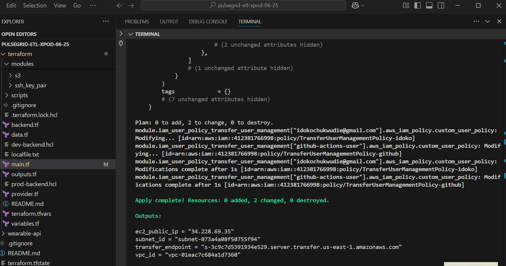

#### Console Output

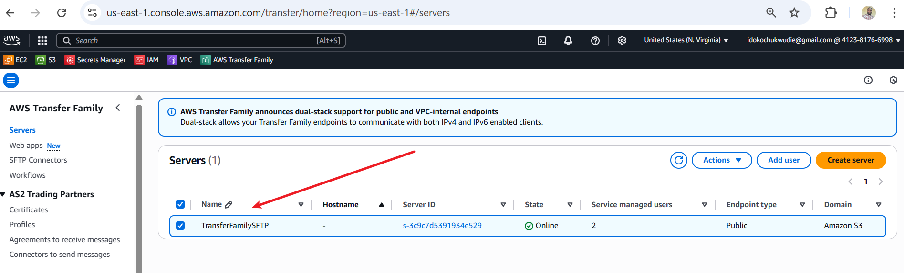

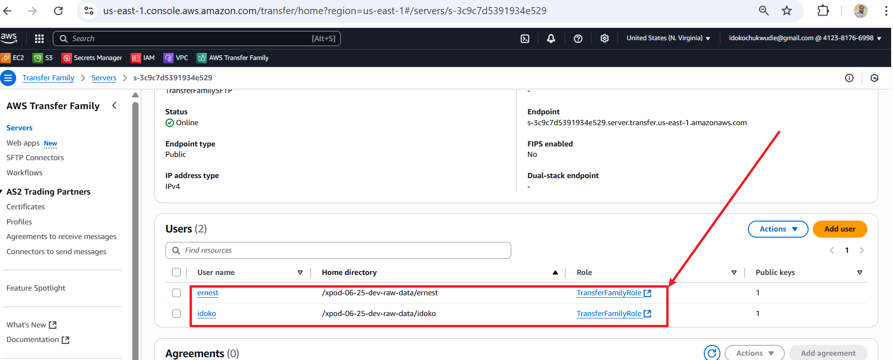

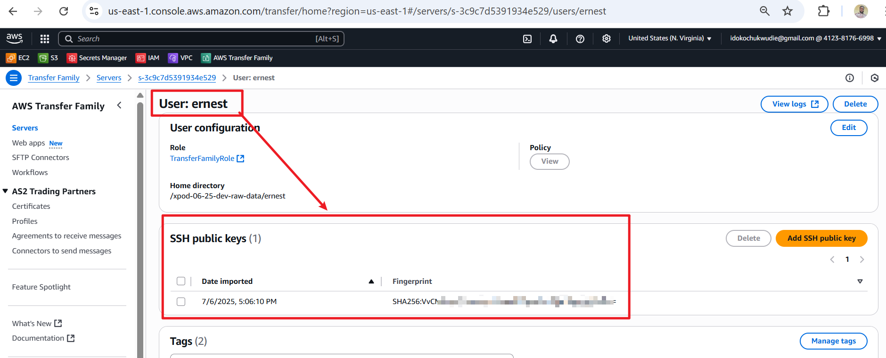

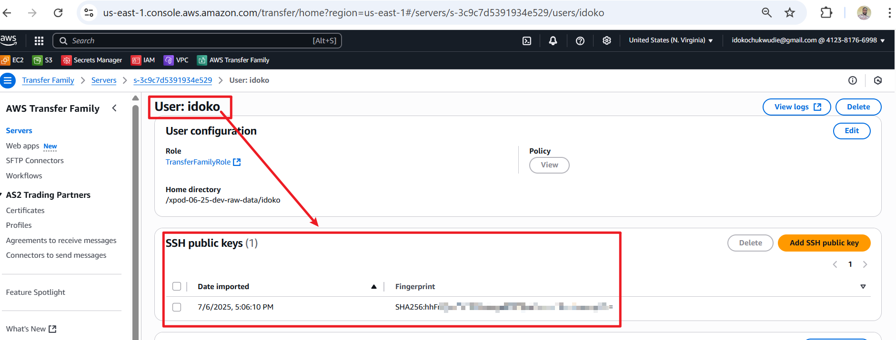

#### Alternatively, use the AWS CLI:

```hcl
aws transfer list-users --server-id s-3c9c7d5391934e529
```

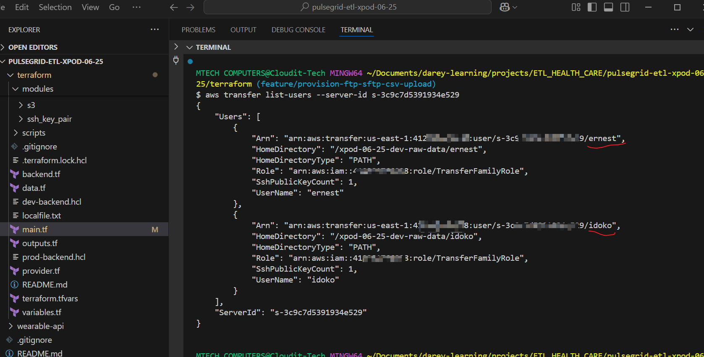

```hcl
aws transfer describe-user \
  --server-id s-3c9c7d5391934e529 \
  --user-name ernest
```

**Repeat for idoko.**


### Step 2: Confirm Local `.pem` Private Keys Exist

#### Purpose:

Ensure the private keys exist locally to enable SFTP login as `ernest` or `idoko`.

Steps Taken:

I ran:

```hcl
find ~/Documents/darey-learning/projects/ETL_HEALTH_CARE/ -type f -name "*.pem"
```

#### Output:

### Step 3: Verify Local Private Key Fingerprints

**Purpose:**

To ensure the local `.pem` keys match the public keys in AWS, confirming key-pair integrity.

**Run:**

```hcl
ssh-keygen -lf .ssh/idoko.pem
ssh-keygen -lf .ssh/ernest.pem
```

Compare the output with what's in the AWS Console:

- idoko key fingerprint: `2f:e8:6c:20:7a:ea:fc:60:ee:1e:f0:a3:89:10:53:b4`
- ernest key fingerprint: `5e:a9:5a:02:9a:38:f9:cb:bf:83:81:b0:89:5d:d3:d6`

#### To Get the MD5-style Fingerprint

Run:

```hcl
ssh-keygen -E md5 -lf .ssh/idoko.pem
ssh-keygen -E md5 -lf .ssh/ernest.pem

```

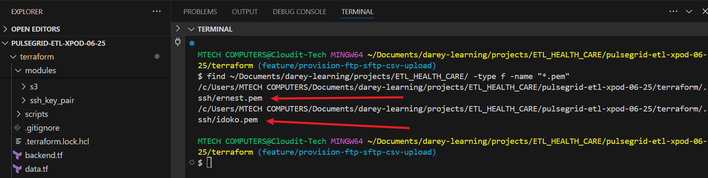

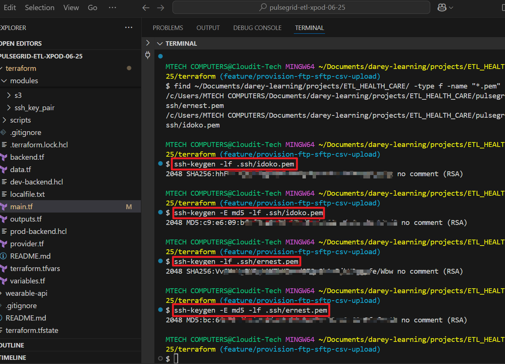

If they match, you're ready to proceed.

### Step 4: Locate the SFTP Endpoint

#### Purpose:

To know where to connect via `SFTP`.

#### Steps Taken:

In the AWS Console:

- Go to **AWS Transfer Family** > **Servers** > Click **Server ID**

- Copy the **Endpoint** URL, e.g.:

```arduino
s-3c9c7d5391934e529.server.transfer.us-east-1.amazonaws.com
```

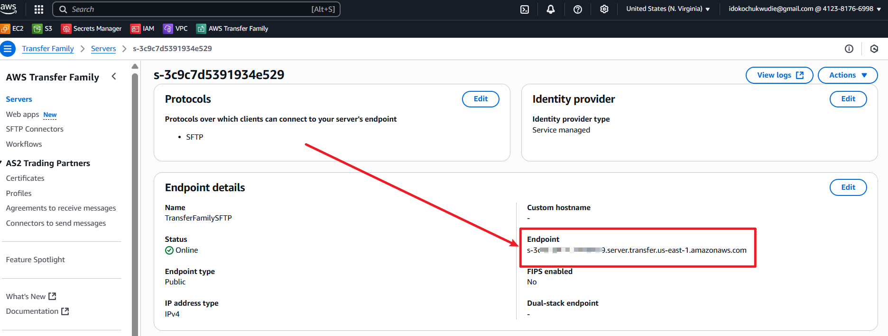

### Step 5: Test SFTP Connection (Login)

**Purpose:**

Verify that users can log in using SFTP and their private key.

#### Run:

```bash
sftp -i ~/.ssh/your-key.pem <username>@<transfer-server-endpoint>
```

#### Expected Output:

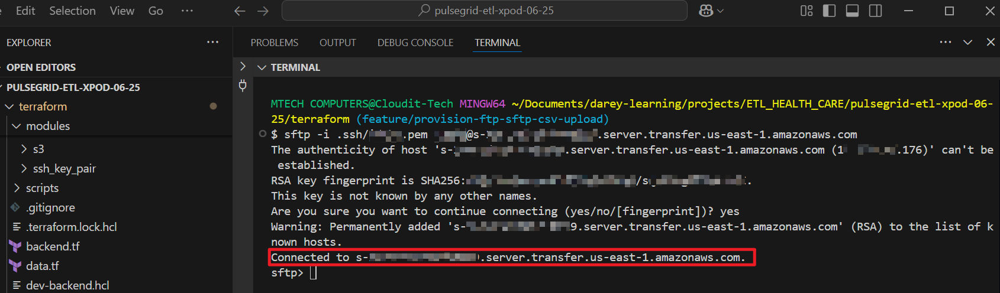


I am now inside the virtual folder mapped to the **raw S3 bucket**.

### Step 6: Create a Sample `.csv` File for Testing

**Purpose:**

To simulate uploading real data to the **raw bucket**.

#### Run: create the CSV files on your local machine

```bash
echo "name,age,location" > test_upload.csv
echo "John,25,Lagos" >> test_upload.csv
echo "Jane,30,Abuja" >> test_upload.csv
```

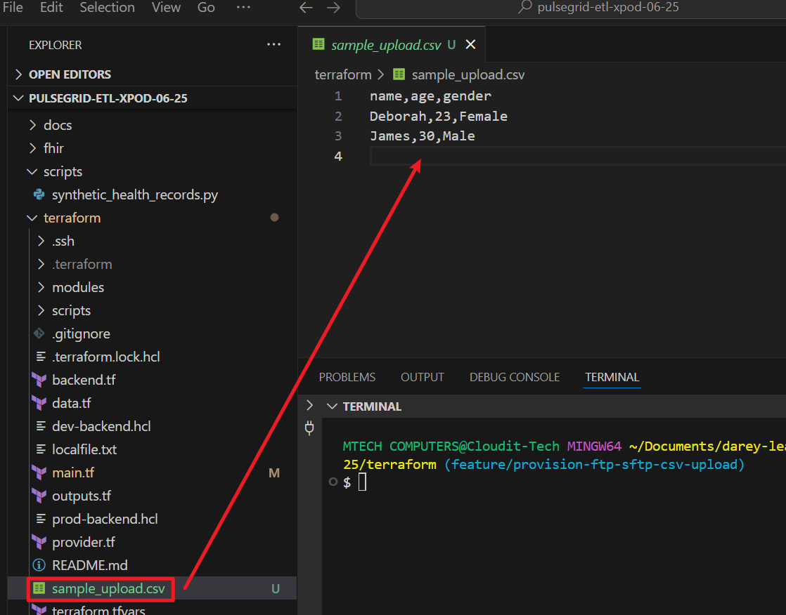

Then, from the same directory, run:

```bash
sftp -i ~/.ssh/your-key.pem <username>@<transfer-server-endpoint>
```

Once inside the SFTP session:

```bash
put sample_upload.csv
```

Use aws `s3 ls` (if configured) to list contents in the `raw folder`:

```bash
aws s3 ls s3://your-raw-bucket-name/
```

#### Terminal Output:

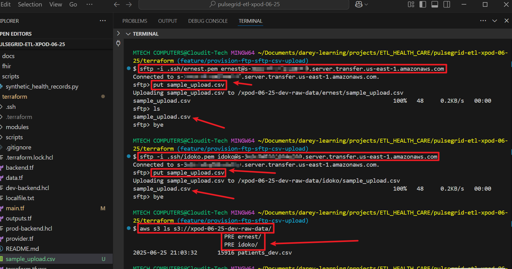

### After upload: How to confirm?

Go to AWS S3 Console → Your raw bucket → Check if the file is there.

### AWS Console Output:

### ernest

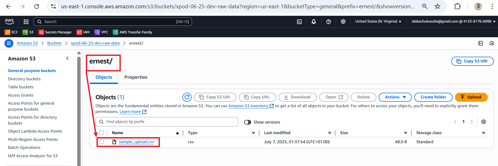

#### idoko

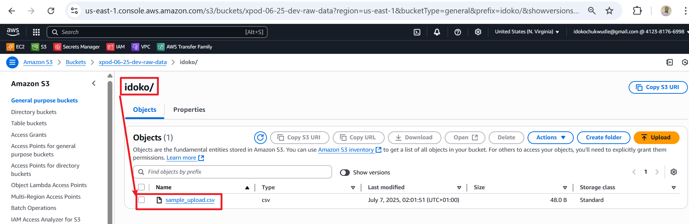

#### user folders

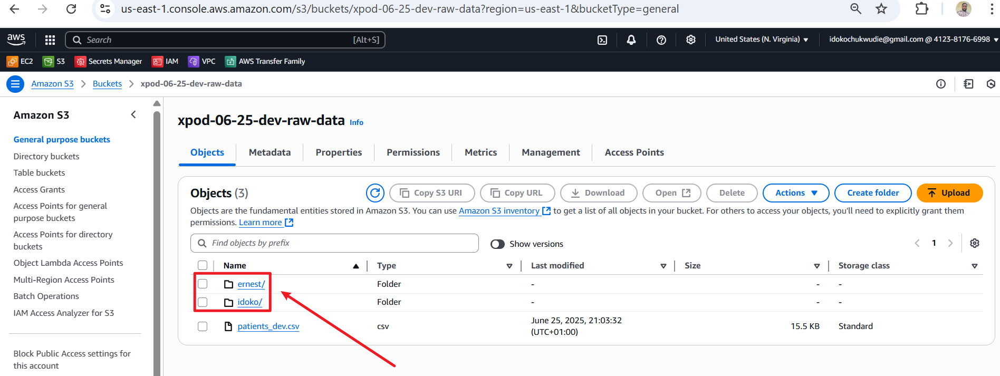

### PIPLELINE

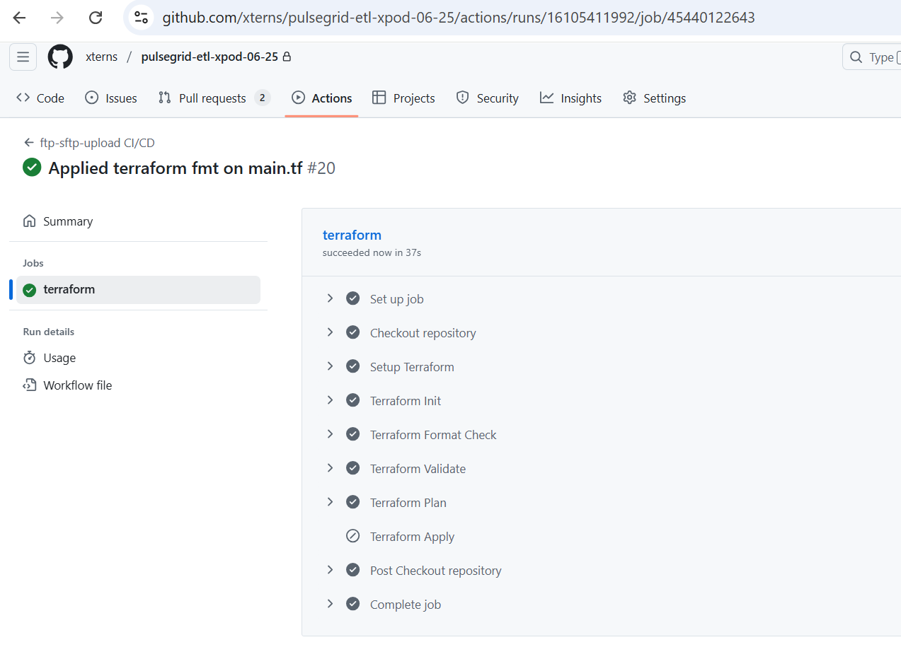

---

## Step 12: Cleanup Strategy and Cost Awareness

### Purpose:

To prevent unexpected charges and clean up cloud infrastructure after testing or demonstration.

#### Steps taken:

I removed all provisioned resources after validation using:

```bash
terraform destroy -auto-approve
```
This command ensures that all resources (EC2, VPC, IAM, Transfer Family servers, SSH keys, and S3 permissions) are fully deleted.

**Cost Awareness:**

**Important:** AWS Transfer Family SFTP servers are billed hourly whether in use or not. EC2 instances and other managed services can also incur costs if left running.

It's a best practice to destroy test environments immediately after use, especially for spike or proof-of-concept projects.

---

## Conclusion

This project successfully demonstrates two secure methods for CSV uploads: using an EC2-based FTP server and AWS Transfer Family SFTP with automated IAM, SSH key provisioning, and S3 integration.

Key achievements include:

- Fully modular infrastructure using Terraform.
- Automated setup using GitHub Actions CI/CD.
- Custom IAM policies for fine-grained access control.
- Dynamic SSH key and SFTP user provisioning using the tls and local_file providers.
- Real-world debugging and resolution of IAM permission errors.
- Cost awareness and cleanup strategy to avoid AWS billing surprises.

By combining modern cloud-native services with reusable infrastructure modules, this solution offers scalability, security, and automation — making it ideal for production or team-based environments.